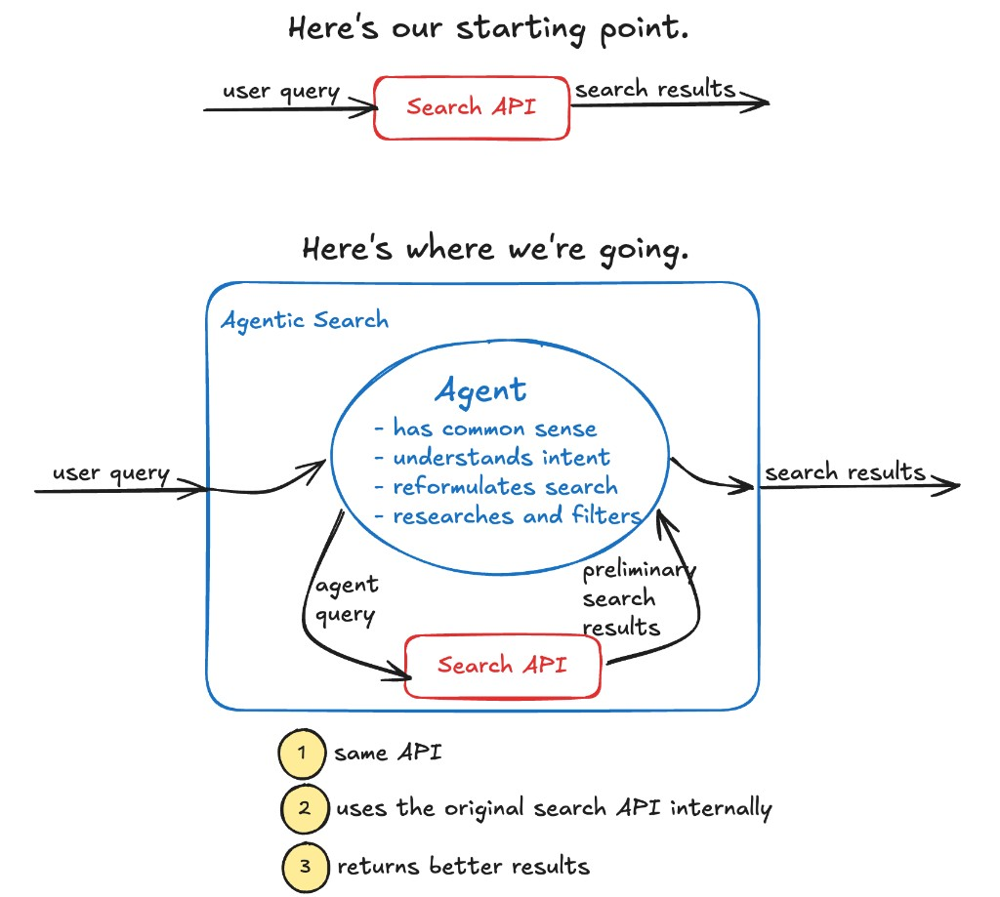
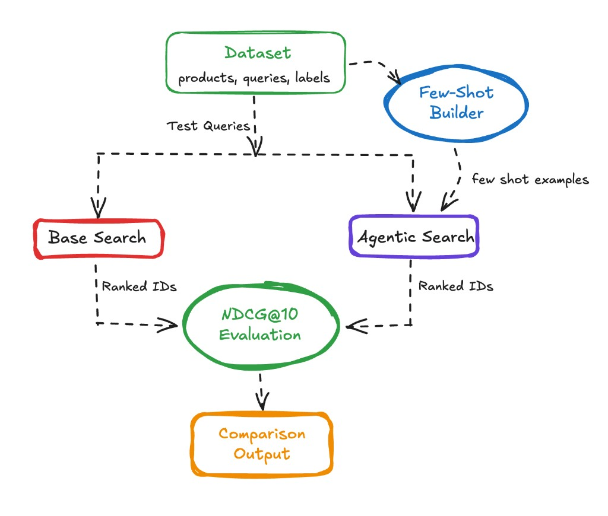

# Make AI Your Search Team

Moving from traditional search to something smarter used to be *very* challenging. Before the current AI revolution, you basically had to hire a full-time machine learning team. But now you can skip all that extra cost and effort.

{ align=center width=100% }

<!-- more -->

!!! note "Prefer watching?"

    Here's a short video walkthrough of this topic:

    <figure markdown="span">
      <iframe width="70%" src="https://www.youtube.com/embed/T2fp8WTVVl4" title="Make AI Your Search Team" frameborder="0" allow="accelerometer; autoplay; clipboard-write; encrypted-media; gyroscope; picture-in-picture" allowfullscreen></iframe>
    </figure>

Let's walk through the traditional progression.

**Level 1 – The lowest common denominator.** You fire up ElasticSearch, point it at your data, and match keywords across all the relevant fields. The search engine isn't psychic. The user types something into a tiny text box, and the best you can do is search across the title and description fields and maybe boost by product popularity. That's about it.

**Level 2 – A little smarter.** For the next step, you can actually go pretty far by hand-tuning search – Take your top 20 queries and experiment with field boosts. Maybe you can get fancier by introducing hand-curated judgment lists and then tune the parameter to optimize the performance against your judgment list.

**Level 3 – Actually smart.** If you want to go farther, you'll need help. You can hire the ML team, and they can set up and tune semantic search and combine it with lexical search to produce some form of hybrid search. They can build complex systems that analyze clickstream data and optimize click-through. For many companies, this level of capability is out of reach because it's expensive and complex. _Not a thing you can typically do at your mom-and-pop Shopify sock shop._

Here's the thing: with modern, agentic AI, you can likely get to level 3 quality without the cost. How? Wrap your base search API in an AI agent. The setup is straightforward – it's your typical while-loop agent with a search tool. Given the user's input, the agent calls the search tool, examines results, refines its queries, and sends back the best products. *The best part is that adopting agentic search doesn't require redoing your UX.* Keep the search API the same, put an agent shim between the API and the engine, and you're done. In this post we'll show you how.

Here's the flow we have in mind:

{ align=center width=100% }

## Rationale

Frontier AI models – and increasingly many of the smaller ones – have strong, real-world common-sense knowledge; they understand most search domains out of the box. With a proper instruction (the system message), you can give the agent an understanding of your users' problem space and your catalog. You can coach it to start with general searches and then narrow down as it rummages through the index. In common domains, models naturally understand synonyms – in cooking, when a customer types "sheet pan" the agent understands that "baking tray" is probably a good alternative worth searching for. It knows when to use quotes – For instance, in fashion, "dress shoes" should be quoted because they are very different from a dress or a tennis shoe. And if you have lots of filter fields – brand, color, size – the model can infer the "grammar" users are speaking and correctly filter the search for more targeted results.

## Experiment

To test this theory, we built an agent-wrapped search against a Wayfair product dataset. The Wayfair dataset contains 42,994 furniture items with names, descriptions, prices, and various categorical fields. Our baseline search was straightforward: tokenize the query, do a case-insensitive match across name and description, and rank by keyword frequency with a slight boost for title matches. Nothing fancy. For the agent, we used GPT-5-mini with a system prompt that explained the dataset schema, available filter fields, and gave it access to the search tool. The prompt instructed it to "help users find furniture that matches their needs" and explained that it could make multiple searches to refine results.

{ align=center width=100% }

Admittedly, this experiment is a bit artificial. We were comparing the agent against our own naive implementation of product search, not Wayfair's actual production system, which is undoubtedly more sophisticated. But the point wasn't to beat Wayfair - it was to see if an agent could improve a basic keyword search with minimal effort. We gave the agent access to a search API, explained the available fields and filters in the system prompt, and let it loose on queries like "modern leather couch under $1000" or "standing desk for small spaces."

We measured quality for both the base search and  using NDCG@10 (Normalized Discounted Cumulative Gain) against a labeled set of 100 queries. Each product was labeled Exact (score 2), Partial (score 1), or Irrelevant (score 0), and the ideal ranking was computed across the full set of labeled products per query – not just what was retrieved. This gave us a meaningful signal for whether the agent was surfacing the right things in the right order, not just returning anything at all.

## Results

The results were mixed, and honestly more interesting because of it. The agent did some genuinely clever things: it understood that "sectional" and "modular sofa" were often the same thing, it knew when to search broadly first and then refine, and it could reason about which fields mattered for different queries. For another query, "modern leather couch under $1000," the baseline search matched on the word "leather" indiscriminately and returned leather-adjacent items – a misstep. But the agent then searched broadly, scanned the top results, and then made a focused follow-up query filtering by price range and category, surfacing items that actually fit all three constraints.

The agent also made some silly mistakes. In earlier iterations, the agent would start off with incredibly constrained queries with over usage of the required match operator ‘+’ and quoted phrases, essentially strangling the search before it began. At other times it would immediately apply filters without even knowing what filter values existed in the dataset – confidently filtering by hierarchy="Bedroom Furniture/Beds" and receiving zero results because that was a hallucinated filter value. These problems can be addressed with more careful prompting in the system message, as we discuss below.

Overall, the agent improved mean NDCG by roughly 6-10% across our 100-query test set depending on the prompt version – a real gain. In aggregate, it won on complex, multi-constraint queries and took a bit longer on simple ones (though rarely at the cost of quality).

## Considerations

The gap between the agent's initial, broken behavior and its improved behavior points to something important: getting agentic search to work well requires care. Here's what we learned.

**Query behavior:** too constrained, too fast. The agent immediately reached for filters and quoted phrases before it knew anything about the index. The fix was prompt-level: instruct it explicitly to make a loose, exploratory query first, use those results to understand the landscape, and then tighten.

**Field blindness:** The agent had trouble with filter fields because it didn't know what the valid options were. Without knowing that `hierarchy` values look like `"Furniture/Living Room Furniture/Chairs & Seating"`, it guessed – and guessed wrong. Providing filter field options directly in the system prompt resolved this, though in production, you'd probably want to give the agent a way to discover facet values dynamically.

**Latency:** Traditional search is screaming fast; agents are not. In our setup, the agent typically made one general query followed by a few parallel focused queries, taking 3-8 seconds total. This isn't acceptable as a drop-in replacement for a search bar – but the framing shifts if you consider that the agent often gets users closer to what they want with less effort. Fewer failed searches mean fewer pogo-stick sessions and more conversions. Whether the math works out depends on your domain and your users. One mitigation: as described in [our post on incremental adoption](../blog/incremental_ai_adoption_for_ecommerce.md), you can start by having the agent make suggestions for better searches rather than serving results directly – thus removing the latency problem from the critical path entirely and allowing the users to adopt the recommended queries if they thought they looked better.

**Few-shot examples:** quality over quantity, and watch for leakage. Once the basic prompt was working, adding few-shot examples had a meaningful impact. We built 12 examples dynamically from our labeled data – roughly balanced across Exact, Partial, and Irrelevant outcomes, randomly sampled with a fixed seed for reproducibility. The examples were chosen to cover a range of query archetypes: single-word ambiguous queries (where the right move is to fan out across categories), brand name searches (where you need to try variations), style descriptor queries (where you need to map casual language to catalog terminology), and typo-heavy queries (where you have to guess at intent before searching). _(Important aside: In order to make sure the agent wasn't cheating, we ensured that the few-shot examples did not include queries from our test set.)_

## Promising Future Work

Beyond per-session few-shot examples, we experimented with a cross-session search memory – an embedding-based store that records what keyword strategies worked or failed for past queries, and retrieves similar past searches at the start of each new one. We've implemented a preliminary version of this [here](https://github.com/JnBrymn/compare-agentic-vs-non-search/blob/main/demo/search_memory.py#L50). (Inspiration drawn from [Doug Turnbull's excellent post](https://softwaredoug.com/blog/2025/10/06/how-much-does-reasoning-improve-search-quality).)

When the agent handled "standing desk for home office," it could see that a previous "standing desk" query had found that `+adjustable` boosted precision and that the `Furniture/Office Furniture/Desks` filter was the right hierarchy – saving it an exploratory round-trip. The implementation used OpenAI's `text-embedding-3-small` to embed each query, stored successful keywords, failed keywords, and a useful category filter alongside a quality rating, and retrieved the top-5 past searches above a 0.75 cosine similarity threshold. 

Fine-tuning seems like a natural next step. A model fine-tuned on examples of good agent search behavior – one that has an intuitive understanding of your index structure and your users' typical needs – should outperform a prompted general-purpose model. We haven't done this yet, but the training data almost writes itself from your query logs.

The neat thing about both of these ideas is that they can be done generically. If someone (Arcturus Labs) wrote a module for search memory and for fine-tuning once, then it could be applied in a very wide variety of scenarios. Therefore, you _still_ wouldn't need to hire that ML team!

## Conclusion

Wrapping your traditional search API in an agentic layer might be the easiest way to meaningfully improve your user's search experience without the expense and complexity of the ML approach. And there's a reasonable chance that the agent may actually be better than fancy hybrid search because the agent comes with some common sense knowledge that can help it better navigate the index. Latency *is* a tradeoff, but one that users will gladly accept if it gets them to the results they want with less friction. Finally, you don't have to do anything radical to the user experience – no need for a chat bot even. The site stays the same, the results get better.

Please know that if anything we've said in this post is true today, it's only going to become *more* true tomorrow. The models are getting better at pretty much everything they do, and at a pace that makes "let's wait and see" an increasingly foolish strategy.

If you have a search application and you'd like to experiment with AI in the loop, [maybe we can help you out](/#contact-blog). If you're interested in seeing more posts like this, [subscribe](/#contact-blog).

---

### _Hey, and if you liked this post, then maybe we should be friends!_

- I recently wrote a book about Prompt Engineering for LLM Applications. [Maybe you'd be interested in reading it.](/#about)
- Are you stumped on a problem with your own agentic product? [Let me hear about it.](/#contact-blog)
- I'm going to write lots more posts. [Subscribe and you'll be the first to know](/#contact-blog).
