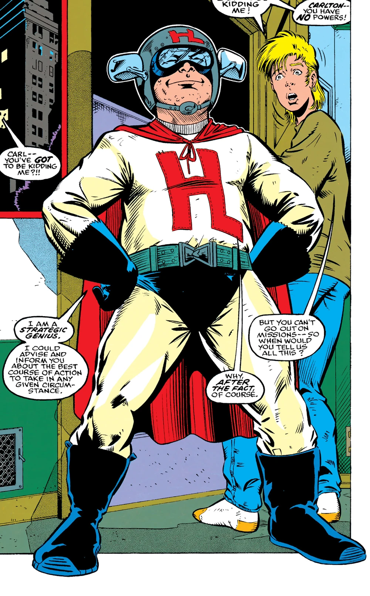
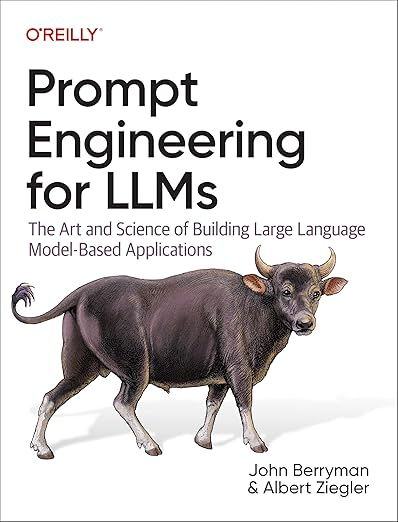

# Bridging the Gap Between Keyword and Semantic Search with SPLADE

In information retrieval, we often find ourselves between two tools: keyword search and semantic search. Each has strengths and limitations. What if we could combine the best of both?

By the end of this post, you will:

- Understand the challenges of keyword and semantic search
- Learn about SPLADE, an approach that bridges these methods
- See a practical implementation of SPLADE to enhance search

If you've struggled with inaccurate search results or wanted a more transparent search system, this post is for you. Let's explore how SPLADE can change your approach to information retrieval.

## The _Unfortunate_ State of the Art

With the rise of RAG methods in prompt engineering, vector-based semantic search has become essential for many applications. It's easy to see why: semantic search overcomes some key limitations of keyword search. In traditional keyword search, you might type terms that mean the same thing as the document you're seeking, but if you use different words, you won't get a match. For example, searching for "ape costume" won't find a document mentioning "gorilla suit." Semantic search, on the other hand, converts your query into a vector representing its meaning. If there's a document with a similar meaning (represented by a nearby vector), you get a match!

Semantic search seems almost magical... until it's not.

There are some gnarly challenges with semantic search that we're still grappling with:

- **Larger indexes** – Keyword search indexes typically grow to 1.5x-2x the original document size. Semantic search indexes can be twice that size.
- **Chunking complexity** – You need to split text into chunks because embedding quality degrades with too much input. But where do you split? Do chunks need to overlap? How do you ensure important context isn't lost?
- **Lack of transparency** – With keyword search, debugging is straightforward – the tokens are human-readable, so you can understand why a document matches. You can adjust queries, field boosts, and phrase matches to tune relevance. Semantic search is opaque; if a query doesn't match as expected, it's hard to understand why. Fixing relevance often means training a new embedding model and reindexing everything. Ouch!

Wouldn't it be great to have the best of both worlds? We want semantic search's ability to match on meaning, combined with the transparency and simplicity of traditional keyword search.

## Enter SPLADE
SPLADE (Sparse Lexical and Expansion Model for First Stage Ranking) was introduced in a [July 2021 paper](https://arxiv.org/abs/2107.05720) and quickly improved upon in [a September follow-up](https://arxiv.org/abs/2109.10086). The concept is simple: instead of asking a semantic model for a meaning-carrying vector, ask it for important terms that _should be in the document_, whether they're actually present or not. For instance, given a document containing "ape costume," the model might identify similar terms like "gorilla orangutan monkey suit clothes." These synthetic terms can then be indexed in a traditional search engine, boosting recall when added to the search field.

In this post, we'll explore how to use SPLADE to enhance your search. We'll create a silly document set (because what fun is it to use a realistic example?), index it, and demonstrate how conventional search can fall short when query terms don't quite match. Then, we'll add SPLADE and show how it addresses this problem.

## Setup

What's your favorite superhero? Superman? Wolverine? Batman? ... Mine's got to be Hindsight Lad – a computer researcher who contributed to his team by critically reviewing past decisions and explaining what they should have done instead. (Real character! Look him up!)

<figure markdown="span">
  { width="400" }
  <figcaption>Image borrowed from the <a href="https://marvel.fandom.com/wiki/Carlton_LaFroyge_(Earth-616)">Marvel fandom wiki</a></figcaption>
</figure>


Inspired by Hindsight Lad, I've chosen superheroes for our example dataset. It's a simple list of superheroes including their names, true identities, descriptions, and superpowers. Here's an excerpt:

| Name | True Identity | Description | Superpowers |
|------|---------------|-------------|-------------|
| Spider-Man | Peter Parker | A high school student bitten by a radioactive spider | Web-slinging, superhuman strength, spider-sense |
| Hindsight Lad | Carlton LaFroyge | A teenager with the ability to analyze past events and point out mistakes | Retroactive clairvoyance, tactical analysis of past events |
| Batman | Bruce Wayne | A billionaire industrialist and philanthropist | Genius-level intellect, master detective, peak human physical condition |
| Arm-Fall-Off Boy | Floyd Belkin | A superhero with the ability to detach his arms | Detachable arms, using detached arms as weapons (yes... another real character!) |
| Superman | Clark Kent | An alien from the planet Krypton | Flight, super strength, heat vision, invulnerability |

To demonstrate the semantic mismatch problem, I've also generated alternative descriptions that convey the same meaning but use almost no common words:

| Name | Alternate Description |
|------|-----------------------|
| Spider-Man | An adolescent scholar affected by an irradiated arachnid |
| Hindsight Lad | A young critic gifted with retrospective wisdom |
| Batman | A wealthy entrepreneur and humanitarian |
| Arm-Fall-Off Boy | A costumed vigilante capable of limb separation |
| Superman | An extraterrestrial being from a distant celestial body |

Our curated list has just 50 heroes, so querying with alternate descriptions might work well for semantic search, but traditional information retrieval will likely struggle.

### Indexing
Let's demonstrate this. Here is function that will index all of our documents:

```python

def index_superheroes(num_tokens=50):
    # Create the index with mappings
    index_name = "superheroes"
    mappings = {
        "mappings": {
            "dynamic": "false",
            "properties": {
                "description": {
                    "type": "text",
                    "analyzer": "english",
                },
                "splade": {
                    "type": "text",
                }
            }
        }
    }

    # delete and recreate the index
    if es.indices.exists(index=index_name):
        es.indices.delete(index=index_name)
        print(f"Index '{index_name}' deleted successfully.")
    else:
        print(f"Index '{index_name}' does not exist.")

    es.indices.create(index=index_name, body=mappings)
    print(f"Index '{index_name}' created successfully.")

    df = pd.read_csv('superheroes.csv')
    # Index the superheroes
    for i, (index, row) in enumerate(df.iterrows(), start=1):
        # Combine the index (superhero name) with the row data
        full_row = pd.concat([pd.Series({'name': index}), row])
        doc = full_row.to_dict()
        doc['splade'] = get_splade_embedding(doc['description'], num_tokens)
        es.index(index=index_name, id=i, body=doc)

    print(f"Indexed {len(df)} superheroes.")
```

This script creates an index with two fields: `description` for superhero descriptions and `splade` for synthetic terms. The SPLADE content is generated by processing the `description` through `get_splade_embedding`, which we'll define next:

```python
from transformers import AutoModelForMaskedLM, AutoTokenizer
import torch

# Load the SPLADE model and tokenizer
model_id = 'naver/splade-cocondenser-ensembledistil'
tokenizer = AutoTokenizer.from_pretrained(model_id)
model = AutoModelForMaskedLM.from_pretrained(model_id)

# Create a mapping from token IDs to tokens
vocab = tokenizer.get_vocab()
id2token = {v: k for k, v in vocab.items()}

def get_splade_embedding(text, num_tokens=50):
    # get the tokens
    tokens = tokenizer(text, return_tensors='pt')

    # get the splade embedding
    output = model(**tokens)
    vec = torch.max(
        torch.log(
            1 + torch.relu(output.logits)
        ) * tokens.attention_mask.unsqueeze(-1),
    dim=1)[0].squeeze()

    # Convert vec to numpy for easier manipulation
    vec_np = vec.detach().numpy()

    # Get indices of non-zero elements
    non_zero_indices = vec_np.nonzero()[0]

    # Create a list of (token, value) pairs for non-zero elements, excluding the input tokens
    token_value_pairs = [
        (id2token[idx], vec_np[idx]) 
        for idx in non_zero_indices 
        if idx not in tokens['input_ids'][0]
    ]

    # Sort by value in descending order
    token_value_pairs.sort(key=lambda x: x[1], reverse=True)

    new_tokens = [token for token, value in token_value_pairs[:num_tokens]]
        
    return new_tokens
```

This code is more complex, but builds on existing work. It's adapted from Pinecone's [SPLADE writeup](https://www.pinecone.io/learn/splade/#SPLADE-Embeddings), with equations detailed in the [SPLADEv2 paper](https://arxiv.org/abs/2109.10086). Essentially, it extracts tokens from input text, uses the SPLADE model to identify important terms (SPLADE tokens), filters out original tokens, converts remaining tokens to readable text, and returns the result.

### Searching
What good is an index that can't be searched? Let's remedy that:

```python
def search_superheroes(description, size, splade):
    # If SPLADE is enabled, we search both the description and SPLADE fields
    if splade:
        # Get SPLADE tokens for the description
        splade_tokens = get_tokens_as_text(description)
        query = {
            "query": {
                "bool": {
                    "should": [
                        {
                            "multi_match": {
                                "query": description,
                                "fields": ["description"]
                            }
                        },
                        {
                            "multi_match": {
                                "query": splade_tokens,
                                "fields": ["splade"]
                            }
                        }
                    ]
                }
            }
        }
    # If SPLADE is not enabled, we only search the description field
    else:
        query = {
            "query": {
                "multi_match": {
                    "query": description,
                    "fields": ["description"]
                }
            }
        }
    # Set the number of results to return
    query['size'] = size
    
    # Execute the search query
    response = es.search(index="superheroes", body=query)

    # Extract the hits from the response
    hits = [hit['_source'] for hit in response['hits']['hits']]
    return hits
```

This function searches for superheroes based on a description (which will be drawn from our alternative 
description list). When `splade` is true, it searches both `description` and `splade` fields; otherwise, only the `description` field.

We still need the `get_tokens_as_text` function to convert descriptions into SPLADE tokens. Note that this doesn't expand the description with synthetic terms, it simply tokenizes it:

```python
def get_tokens_as_text(text):
    tokens = tokenizer(text, return_tensors='pt').input_ids[0]
    return ' '.join([id2token[i] for i in tokens.tolist()][1:-1])
```

Now we're ready to see if this all actually works!

## Demo Time
Let's take the above code out for a spin.

First we index our superheroes with `index_superheroes(num_tokens=50)`. Here we inject up to 50 SPLADE tokens for each row in our data set.

Next, with SPLADE turned off, let's see if we can catch Iron Man using his alternative description:

```python
use_splade = false

hero = "Iron Man"
alt_description = hero_dict_alt[hero]
search_results = search_superheroes(alt_description, 3, use_splade)
result_heroes = [result['name'] for result in search_results]

print(result_heroes)
```

```
['Beast']
```

Nope... that's a miss! Well, after I've spent all this time writing a blog post, I hope that we can turn SPLADE back on and see Iron Man in the results.

```
['Black Panther', 'Iron Man', 'Beast']
```

Yay! I mean, I would have preferred that Iron Man was number 1 in the search results. But being in the top 3 results out of 50 for something as generic as "A brilliant innovator and corporate magnate" is not bad.

But perhaps we were lucky with this example. Let's create a new function `recall_at_3` that will run through every hero and and see if SPLADE is actually helping us improve recall.

```python
def recall_at_3(splade):
    counter = 0
    for hero in hero_dict.keys():
        alt_description = hero_dict_alt[hero]
        search_results = search_superheroes(alt_description, 3, splade)
        result_heroes = [result['name'] for result in search_results]
        # Check if the hero is in the top 3 search results
        if hero in result_heroes:
            counter += 1
    
    # Calculate and return the recall@3 score
    return counter / len(hero_dict.keys())
```

First we test without SPLADE `recall_at_3(False)` and see that the recall is 28% – as expected, not great. Now with SPLADE `recall_at_3(True)` returns _(... drum roll please ...)_ 52%.

Alright! (Whew!) So by injecting synthetic tokens into our indexed documents we have improved recall (recall@3 to be precise) by a hefty 24%!

## Retrospective
I can feel my inner Hindsight Lad jumping up and down in my head. It's time to take a closer, more critical look at what we just accomplished. SPLADE is definitely neat, but it doesn't fix all of the problems we've identified with semantic search.

<figure markdown="span">
  { width="400" }
  <figcaption>Image borrowed from the <a href="https://x.com/joepatrick116/status/1463351832458244097">some guy on X</a></figcaption>
</figure>

We've improved recall, but in a longer blog post (which I shall never write) we would also look at how precision changes. The problem is that sometimes the synthetic tokens produced in `get_splade_embedding` can be... wonky. Take a look at this example:

```python
get_splade_embedding("mary had a little lamb, it's fleece was white as snow", 15)
```

```
['marriage',
 'married',
 'winter',
 'song',
 'wedding',
 'have',
 'sheep',
 'whites',
 'baby',
 'like',
 'color',
 'wearing',
 'film',
 'character',
 'murder']
```

There's a lot going on here. We start off with several words related to marriage (which is not mentioned in the original song) and then right at the end it takes a darker turn with `murder`. You know how the rest of that song goes, and these words are clearly a miss. There are also a couple of stop words (super common words) in there: `have`, and `like`. This will definitely increase recall as it will match about half of the docs in the index, but this will take it's toll on precision.

Next, my SPLADE implementation in Elasticsearch is oversimplified. If you scroll back up to `get_splade_embedding`, we extract non-zero elements from `vec_np` (the SPLADE tokens) but discard their associated weights. This is a missed opportunity. The SPLADE papers use these weights for scoring matches. Incorporating this nuance – for instance, the fact that _murder_ is less relevant to Mary than _sheep_, _song_, _baby_, and _white_ – would significantly enhance precision.

Finally, one of the problems with semantic search that we were trying to avoid is the complexity of dealing with the embedding model when it doesn't quite do what you want it to do. When an embedding model doesn't match the correct documents, then your only option is to retrain the model, reindex, and hope. But with SPLADE, if it thinks that Mary likes murder, our options aren't much better. The main benefit of SPLADE in this case is that you can actually see the words produced by the model, (rather than an opaque vector). This will make it easier to debug the problem and improve it. ... Maybe SPLADE's training data had too many references to Mary I of England (you know... "Bloody Mary").

## Conclusion
SPLADE is a promising approach that bridges the gap between traditional keyword search and modern semantic search. And this is a good thing! In many ways, good ol' keyword search is the right tool because it's relatively simple, it's well understood, and it's easy to scale and maintain. But traditional keyword search still falls short when it comes to matching on meaning.

This post is begging for follow-up posts:

- How does my implementation of SPLADE+Elasticsearch affect precision?
- How does semantic search perform against my implementation of SPLADE+Elasticsearch?
- Can we improve SPLADE+Elasticsearch? I want to see how tough it is to get the SPLADE weights into the Elasticsearch scoring.
- Did you know that Elasticsearch offers a SPLADE-like solution called [ESLER](https://www.elastic.co/search-labs/blog/elastic-learned-sparse-encoder-elser-retrieval-performance)? I wonder how that compares with the solution presented here.

If you're interested in hearing more about this topic, then let me know. We could write a post together about it.


## Before You Go: Exciting News!

While we're on the topic of innovative technologies, I'm thrilled to announce that I'm authoring a book on [LLM Application Development](https://amzn.to/3zKIxGG), set to release in November 2024. This book distills years of experience building production-grade LLM applications at GitHub and for various consulting clients into practical, actionable insights.

<figure markdown="span">
  { width="400" }
</figure>


What's in it for you?

- Insider tips and tricks from real-world LLM projects
- Strategies to overcome common challenges in LLM application development
- A comprehensive guide to building robust, scalable LLM solutions

Are you currently working on an LLM application and facing roadblocks? Or perhaps you're looking to leverage LLMs in your next big project? I'd be delighted to lend my expertise. Reach out to me at jfberryman﹫gmail‧com for consulting inquiries or just to chat about the exciting world of LLMs!

Let's push the boundaries of what's possible with LLMs together!