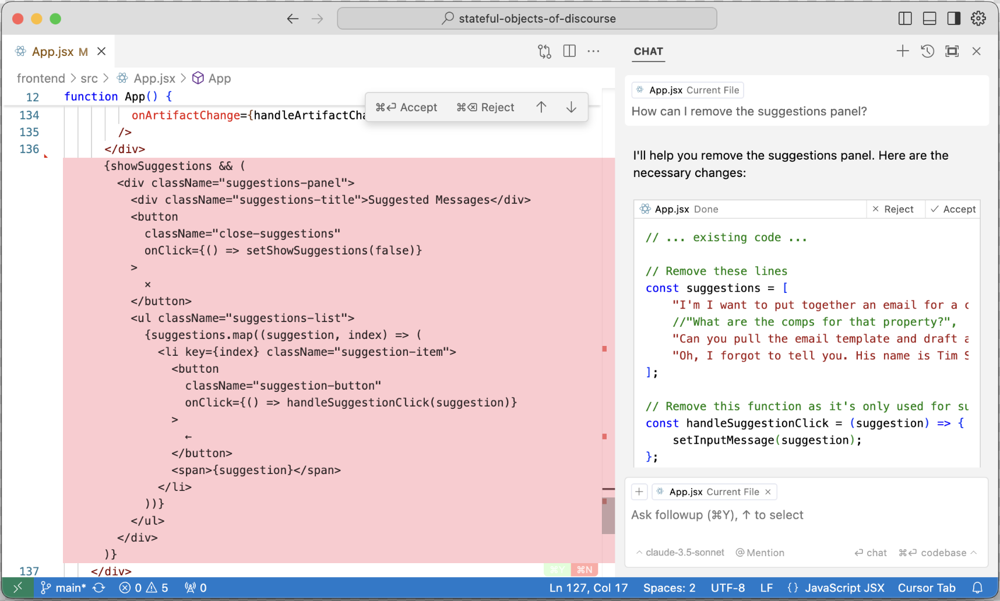

#  Boost User Experience with Artifact-Aware Assistants

<!-- TODO! 
- Review the actual website to make sure it makes sense

-->

{ align=left width=100% }

Most chat applications are leaving something important on the table when it comes to user experience. Users are not satisfied with just chit-chatting with an AI assistant. Users want to work _on_ something with the _help_ of the assistant. This is where the prevailing conversation falls short.

Consider pair programming. In a real, human pairing session, you and your partner discuss your objectives, talk about how the code should be modified, and then take turns actually modifying the code to implement your ideas. In this scenario – and in most where work is to be done – there is the _discussion_ and then there are the _objects_ of the discussion.

Contrast this with the naive AI assistant chat in which the assistant is not able to make the distinction between the discussion and the things being discussed. The assistant may come up with fantastic ideas about how to write your report or accomplish your task, but those ideas are quickly lost in the scrollback. And if there are multiple objects floating around in the discussion, then it's nearly impossible to tell the assistant which objects you're talking about and which version and how they relate to one another. At the end of the conversation, the user might find themselves scrolling back to copy out pieces of the conversation that they need.

The answer to this problem is _artifacts_. Artifacts, are referenceable chunks of stateful content. Artifacts are the objects of the discussion and the items being worked upon. Both the assistant and the user have the ability to create, retrieve, update, and delete these artifacts and to refer to them as needed.

In this post I will show you how to step beyond the status quo and build a better user experience with artifact-aware AI assistants.


## Status Quo – No Artifacts

But first, let's take a closer look at the status quo experience, just to drive home the pain. In the demo below, the user (blue text) is a real-estate. The real-estate agent is working with an AI assistant to prepare an home listing email to send to a client. Here we are using a naive assistant - one that doesn't understand artifacts.  (The panel on the right is intended to hold artifacts – we'll put it to good use in a moment.) 

<div style="width: 100%; height: 700px;">
  <iframe src="https://arcturus-artifact-aware-assistant.fly.dev/?dumb&recorded&noSuggestions" style="width: 100%; height: 100%; border: none;"></iframe>
</div>

There's a lot going on here.
- First, the real-estate agent asks the assistant to retrieve a home listing. The assistant complies – and also proactively retrieves the email template – but, unless the agent digs through the tool usage, they don't know anything more about the listing than what the assistant tells them. _Is this even the right listing?_
- Next, the real-estate agent asks the assistant to prepare the email. The assistant complies by generating a draft in their follow-up message. The annoying part here is that there is no boundary between the assistant's text and the object that we are working on. It's just one big blob of text.
- The buyer's name and agent's names have been omitted, so the agent asks the assistant to update the email with the correct names, but also to add their name to the template. The assistant complies with the email, but ignores the request to fix the template because it doesn't know how to comply.
- If the real-estate agent wants to use the email, they have to scroll around and copy-paste it out and send it themselves. This is unnecessary toil.

This is not be a good experience. The user feels lost (not able to see the original data), confused (they can't see the data that the assistant can see), and overburdened (it's on you to extract the work and apply it). And if the conversation were to continue, it would only get worse. More items will be discussed, many of them will have several versions, and all of it will be scattered in the scrollback and effectively lost.

## The New State of the Art – Artifacts
Some bigger players are starting to pick up on the need. The most obvious example is Anthropic with their popular Artifacts implementation. This allows users to describe diagrams, documents, and small applications and see them come into existence in a panel to the right of the conversation. OpenAI followed up quickly with their own implementation, Canvas. These are both good examples of Artifacts, but (to me at least) they feel like toy applications, because you're not likely to ship the results of these applications into production. Also, the interactions you can have with the artifacts are limited. For instance, with Anthropic's Artifacts, the user is unable to directly edit artifacts, and it's cumbersome to ask the assistant to make changes that would be easy to do on your own. <!-- You can share Artifacts, but they are still confined to Anthropic's web page. And if feels clunky to work with multiple artifacts or artifacts with different versions. -->

<!--
A better example of artifacts, and the best that I have found in the wild, is the user experience that Cursor provides. If you're not familiar with Cursor, it is a fork of the VSCode IDE that encourages users to build code with the help of an AI programming assistant. The assistant is aware of all the relevant files in a project – the artifacts. So that when you ask for some change in code, then, in the conversation panel, the assistant tells you how it will modify the code, sometimes across many files, and it explains its decisions. It then allows you to accept or dismiss its recommendations. It also makes it easy for the user to direct the assisstant's attention to a particular file or snippet, and similarly the assistant can direct the user's attention to the relevant code.


<figure markdown="span">
  { width="100%" }

</figure>
-->


Let's take another look at our real-estate application, but this time let's make it artifact aware.

<div style="width: 100%; height: 700px;">
  <iframe src="https://arcturus-artifact-aware-assistant.fly.dev/?recorded&noSuggestions" style="width: 100%; height: 100%; border: none;"></iframe>
</div>

- The real-estate agent starts by asking the assistant to retrieve the home listing, and it does. But this time the assistant response includes a link to one of the artifacts in the artifact panel on the right. There the agent can see the full details of the home listing. In this simple demo the artifacts are just bare JSON. But in a real application, the home listing would include a image carousel, property details, interactive maps, and integrated scheduling for viewings.
- The agent asks the assistant to create the email according to their saved template. This time two new artifacts appear. The first is the template retrieved from the `get_email_template` tool call. The second is customized email generated by the assistant which pulls the contents of the listing into the template.
- Finally, the agent tells the assistant to correct the names in the email and to update the template. And the assistant does as it's told! In the conversation it provides links to the updated artifacts and explains the actions taken.

This experience is _so much_ better than before. It's intuitive because it's how conversation work in real life: you have a _conversation_ about your _work_. In the left panel is the conversation and in the right panel are the work items of work being referred to. When the assistant talks _about_ the work, it conveniently links to the actual artifact so that you can review the full details. The assistant understands that it can create, retrieve, and update artifacts – which leads to a much more coherent interaction. And you don't have to copy-paste assets out of the scrollback. If this were a real application, you would likely even send the email directly from the app!

!!! note "Now You Try!"

    If you have a moment, try the demo yourself and compare the difference between the two assistants:

    - **[Naive assistant](https://arcturus-artifact-aware-assistant.fly.dev/?dumb)**
    - **[Artifact-aware assistant](https://arcturus-artifact-aware-assistant.fly.dev/)**

    Note that I've added some suggested comments to get you started. Make sure to let me know if you find anything interesting (... or broken).


## Implementing Artifact-Aware Assistants
<!-- TODO add link to "build a basic assistant" blog post -->
Artifact-aware assistants require coordinated implementation in the backend, frontend, and system message. Fortunately it's actually rather simple.

### System Message

In order to build an artifact-aware assistant, the first thing you need to do is to convey to the model what artifacts are, and how they work. Here's the system message that I used to build the above demo.

??? note "Artifacts System Message"
    ```
    You are a helpful assistant.

    <artifacts_info>
    Artifacts are self-contained pieces of content that can be referenced in the conversation. The assistant can generate artifacts during the course of the conversation upon request of the user. Artifacts have the following format:

    ˋˋˋ
    <artifact identifier="acG9fb4a" type="mime_type" title="title">
    ...actual content of the artifact...
    </artifact>
    ˋˋˋ

    <artifact_instructions>
    
    - The user has access to the artifacts. They will be visible in a window on their screen called the "Artifact Viewer". Therefore, the assistant should only provide the highest level summary of the artifact content in the conversation because the user will have access to the artifact and can read it.
    - The assistant should reference artifacts by `identifier` using an anchor tag like this: `<a href="#18bacG4a">linked text</a>`.
    - If the user says "Pull up this or that resource", then the assistant can say "I found this resource: <a href="#18bacG4a">linked text</a>".
    - The linked text should make sense in the context of the conversation. The assistant must supply the linked text. The artifact title is often a good choice.
    - The user can similarly refer to the artifacts via an anchor. But they can also just say "the thing we were discussing earlier".
    - The assistant can create artifacts on behalf of the user, but only if the user asks for it.
    - The assistant will specify the information below:
        - identifiers: Must be unique 8 character hex strings. Examples: 18bacG4a, 3baf9f83, 98acb34d
        - types: MIME types. Examples: text/markdown, text/plain, application/json, image/svg+xml
        - titles: Must be short, descriptive, and unique. Examples: "Simple Python factorial script", "Blue circle SVG", "Metrics dashboard React component"
        - content: The actual content of the artifact and must conform to the artifact's type and correspond to the title.
    - To create an artifact, the assistant should simply write the content in the format specified above. The content will not be visible to the user in chat, but instead will be visible in the Artifact Viewer. After creating an artifact, they can refer to it in the conversation using an anchor tag as described above. Example:
        ˋˋˋ
        HUMAN: Create a simple Python int sort function.
        ASSISTANT: I will create a simple Python merge sort function.
        <artifact identifier="18bacG4a" type="text/markdown" title="Simple Python int sort function">
        def sort_ints(ints):
            if len(ints) <= 1:
                return ints
                
            mid = len(ints) // 2
            left = sort_ints(ints[:mid])
            right = sort_ints(ints[mid:])
            
            # Merge sorted halves
            result = []
            i = j = 0
            while i < len(left) and j < len(right):
                if left[i] <= right[j]:
                    result.append(left[i])
                    i += 1
                else:
                    result.append(right[j])
                    j += 1
                    
            result.extend(left[i:])
            result.extend(right[j:])
            return result
        </artifact>

        It is available in the Artifact Viewer as <a href="#18bacG4a">Simple Python int sort function</a>.
        ˋˋˋ
    - The assistant can edit artifacts. They do this by simply rewriting the artifact content.
    - If the user asks the assistant to edit the content of an artifact, the assistant should rewrite the full artifact (e.g. keeping the same identifier, but modifying the content and the title if needed).
    - The user doesn't have to explicitly ask to edit an "artifact". They can just say "modify that" or "change that" or something similar.
    - When editing the artifact, you must completely reproduce the full artifact block, including the identifier, type, and title. Example:
        ˋˋˋ
        HUMAN: Make that sorting function sort in descending order.
        ASSISTANT: <artifact identifier="18bacG4a" type="text/markdown" title="Simple Python int sort function (descending)">
        def sort_ints(ints):
            if len(ints) <= 1:
                return ints
                
            mid = len(ints) // 2
            left = sort_ints(ints[:mid])
            right = sort_ints(ints[mid:])
            
            # Merge sorted halves in descending order
            result = []
            i = j = 0
            while i < len(left) and j < len(right):
                if left[i] >= right[j]:  # Changed <= to >= for descending order
                    result.append(left[i])
                    i += 1
                else:
                    result.append(right[j])
                    j += 1
                    
            result.extend(left[i:])
            result.extend(right[j:])
            return result
        </artifact>
        ˋˋˋ
    - All existing artifacts are presented in the <artifacts> tag below.
    </artifact_instructions>

    </artifacts_info>

    <artifacts>
    <artifact identifier="ab3f42ca" type="application/json" title="123 Maple Street Listing">
    {
        "address": "123 Maple Street",
        "price": 450000,
        "bedrooms": 3,
        "bathrooms": 2,
        "sqft": 1800,
        "description": "Charming craftsman with original hardwood floors",
        "yearBuilt": 1925,
        "status": "For Sale"
    }
    </artifact>
    </artifacts>
    ```

The approach here is straightforward.
 
- Explain what an artifact is - a formatted blob of information that takes the form

    ```
    <artifact identifier="d3adb33f" type="application/json" title="The Title">
        ... content ...
    </artifact>
    ```
    
    Further, explain the expected format and constraints of the fields.

- Explain that the user can see these the artifacts, and therefore the assistant does not need to recreate them in its messages. Instead, the assistant should refer to the artifact using a link formatted as `<a href="d3adb33f">link text</a>`.
- Explain that the assistant can both create and modify artifacts by retyping them. I've included a couple of example interactions to help the model out.
- Finally, present the existing artifacts to the assistant.

This simple system message works quite well even though the model I'm using, claude-3-5-sonnet, is not trained on artifacts. I think the reason for this is because the models are used to text that includes references. In natural language we use, nicknames and pronouns. In programming we refer to variables and packages. And in HTML – which is found in abundance in training – we use links! Thus, the model has ample training to differentiate the content of a conversation from the objects of discourse.


### Backend Implementation
A naive assistant (not aware of artifacts) is implemented as a loop which keeps track of messages in a conversation. When a user submits a message, the assistant:

1. Appends the user message to the existing messages.
2. Sends the message list to the model and then retrieves the response message. (If you use tool calling, then that also happens here.)
3. Appends the response message to the list of existing messages as the _assistant_ message.
4. Sends the assistant message back to the user.

With an artifact-aware assistant, you have to keep track of both the messages and the artifacts, so there are a couple of extra steps. When a user submits a message, the assistant:

1. Extracts any artifacts from the user message (for instance if the user created a new work item) and replaces them with links.
2. Generates the system message, which contains both the instructions and the list of all artifacts.
3. Append the user message to the existing messages.
4. Sends the system message and conversation messages to the model. In the demo we are using tool calling, so there's also a for-loop handling tool invocations.
5. Extract artifacts that are either generated by the assistant or retrieved from a tool call and replace them with links.
6. Send the assistant message and the artifacts back to the user.

I must make a note on artifact extraction. In my implementation, the assistant is able to modify existing artifacts. It does this by simply rewriting the artifact in the conversation. (In the demo, this is automatically replaced with links, so the user only ever sees the artifacts in the artifact panel.) Since the assistant can rewrite artifacts, this means that there can be multiple versions of the same artifacts. The way I'm handling this is to use the most recent version and delete the old version of the artifact. In a more sophisticated implementation, perhaps we would track the changes to the artifacts so that the assistant can understand their history.

### Frontend Implementation
The frontend requires changes as well. Most notably, you need a place to present the artifacts. In the demo, this is a dedicated panel to the right of the conversation. If your UI doesn't have room for that, then there are alternatives. For instance, you can have a tabbed chat window that allows the user to flip over and see the artifacts. Or you can still incorporate the artifacts into the chat as embedded UI elements. This loses some of the benefit because your artifacts will scroll away as the conversation continues, but at least the artifacts aren't just blobs of text - they can be made into "smart" objects that the user can interact with.

The chat panel requires a small update. The backend will now return messages that include links to the tabs in the artifacts. Make sure that these links look nice and, most importantly, reveal the corresponding item in the artifact panel when clicked.

Next, unlike with Anthropic Artifacts, why not let the user directly edit the artifacts? Make sure to capture the edits and send the updated artifacts to the backend.

Finally, I haven't done this with my demo, but if the assistant is creating and updating artifacts, it is probably important to make sure the user can understand the changes and explicitly accept or reject them. Perhaps the best approach is to follow Cursor's lead (another good example of an artifact-aware application) and present the users with a GitHub-style red/green diff of the changes, and a button beside each that allows the user to accept or reject the change.

!!! note "Check It Out"

    If you'd like to see how the sausage is made, check out the repo that implements the demo here:
    
    **[https://github.com/arcturus-labs/artifact-aware-assistant](https://github.com/arcturus-labs/artifact-aware-assistant)**
    
    Warning, it is _not_ production-ready code!    

## Conclusion

Hopefully I've convinced you that artifact-aware assistants are often a much better experience for your users than the naive alternative. And fortunately, they're just not that hard to set up. The demo that I prepared for this blog post is just the tip of the iceberg. Consider other possibilities that artifacts unlock:

- Interactive artifacts that presented themselves in a malleable user interface. For instance a home listing, complete with an image carousel and an interactive map.
- Durable artifacts that save themselves to disk as they are created and updated. Such as a modified email template.
- Active artifacts that accomplish real work. Imagine an email artifact that sends itself with the click of a button.
- Rich versioning, allowing the user to traverse the changes associated with this artifact and link to the portion of the conversation where the change occurred.

I bet that you can think of plenty more things!
