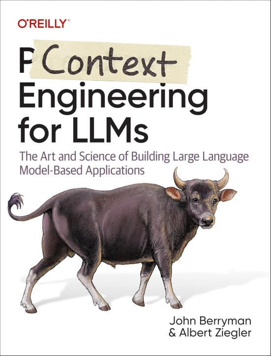

A big part of context engineering comes down to ***empathy***. ... Does this sound surprising?

Consider this, LLMs have been trained to act like humans. So when you are building an AI agent, it's a useful exercise to put yourself in their shoes and walk around a bit. For me, I like to think of the AI agent as if it's an AI intern showing up for its first day of work. How would _you_ feel if you were coming in for your first day of work and the boss gave you 50 pages to read? What if you only learned what you were supposed to do with this information after you had already read the 50 pages? And what if the instructions were poorly written, ambiguous, and impossible to achieve with the tools provided!?

In this post I'll go over several places where I've learned to empathize with the AI Intern. But understanding the world from their unique vantage point, you can build better context for the agents and drastically improve the quality of your AI application.

{ align=left width=100% }

<!-- more -->

## Bright but not psychic

The AI intern is exceptionally bright - he has read the internet several times and has memorized much of it. However, the intern is not psychic – he can't know information that is hidden behind corporate walls (client information, documentation). Therefore _you_ have to provide this information for him or give him tools to get at it (context engineering). The intern also needs tools to access realtime data.

Similarly, he has no knowledge of current events – a search tool comes in handy here, and the frontier models are getting really good at knowing when they need to use search.

## Prefers familiarity

In training, the intern has read lots of markdown, lots of html, plenty of standardized forms; the intern is familiar with commonly used processes and niche jargon. Therefore, if you can frame the intern's work to make use of familiar ideas and patterns, then you won't have to spend so much time explaining the task, and the intern is much more likely to just get it right.

In our book (see below) we called this the Red Riding Hood principle – stay on the well trodden path because wolves are hiding in the forest.

## Can't read gobbledygook

This is where prompt engineering is important. If you dump tons of information and scraps of text into the context without explaining it, then you're like the bad boss that slams the thick manilla folder on the intern's desk and yells "deal with it!" Instead, take time to help the intern understand their task:

- In the system message, lay out the context for the work. What are we doing? What is the goal we are trying to accomplish? What is a good outcome?
- Tell the intern their role in all of this. How are they to act? What tone should they take?
- Give the intern instructions on how to accomplish their goal. If he has clear steps to follow, the work will be easier to accomplish.
- Provide examples. The AI intern has amazing pattern recognition and a few examples do wonders – again, this is _especially true_ if there aren't many examples in training.
- When providing the intern with context (documents, images), tell him how these might be of use in solving their problem. If you just have scraps of text, give the intern some sense of the context that this text was found within.
- Provide the intern with tools to do their work. Make sure that all tools are distinct – avoid confusing overlaps in domain. Use clear naming conventions and rich descriptions for the tool and argument names. If _you_ wouldn't be able to understand how to use these tools, then your intern is sunk!

## Needs time to think

Your AI intern, just like you, does better when they have time to think. Before extracting complicated information from documentation, ask yourself if you would need to think a bit before performing the task. If so, give your intern the same allowance.

The AI intern thinks by speaking (like I do... which is sometimes annoying) – let them do it! Challenge them to reason about the answer prior to providing the final result, or use a reasoning model which has been trained to be _good_ at talking to itself about the problem. Once the intern has jabbered on for a bit, they will more likely to arrive at a more well-reasoned answer.

## Has difficulties with attention

The intern is paradoxically both inattentive and hyperfocused.

Inattention: If you drop long chunks of text into the prompt – especially if they have long chunks of unrelated content – then at some point in the middle, the intern gets bored, quits paying attention, and misses important details. In our book, we refer to this place as the "Valley of Meh".

Hyperfocus: But, if the AI intern feels like he's really on a roll with his current approach, then he will sometimes follow that approach too far and fail to recognize that it's no longer beneficial.

The fix for inattention requires strong context engineering. The middle chapters of our book focuses on this:
1) select content carefully, 
2) assign scores and priorities to content based upon how relevant it is, 
3) extract the core pieces of content that are most relevant, and
4) assemble into a prompt document that clearly lays out the significance of the text and how it is to be used.

The remediation for hyperfocus is more about good application design, (which is covered in the latter chapters of the book.) Don't give your intern important and complex tasks without also giving them oversight. This could come in the form of a workflow that breaks complex tasks into simpler steps, or it could come in the form of a user experience that keeps the user in the loop, guiding and correcting the intern when they make small, forgivable mistakes.

## Is a convincing liar and sycophant

Ah... the darker side of our AI intern. In order to keep you impressed, and to keep his job, you will often catch your intern in a lie or in unnecessary flattery. To deal with this:

- Never give the intern a mission critical task that can't either be verified algorithmically or by a human that has oversight.
- The most common form of oversight is fact grounding - making sure that the individual claims are justified by content in the provided context. You can ground the claims yourself by creating a side-agent that picks out claims and verifies them individually.
- If your agent is acting as a classifier, but you don't know all the possible classes, then make sure the agent has the option to say "other" or "unknown", otherwise you are compelling him to lie.
- Make sure that your agent has the tools that he needs to get the job done. If you ask an agent for information about a recent event, but he doesn't have a web search tool, then he is likely to just make up a story to appease you. If he has the search tool, then it will more likely go to the internet and get the facts he needs.

## Has unusual vision and reading disabilities

The AI intern has some pretty unusual vision and reading disabilities. For one thing, he can't really see letters. He sees tokens, which are like blurry chunks of letters. This sometimes causes confusion, like when you ask the intern for how many 'R's are in 'strawberry' and he says 2.

The intern also isn't so great at reading tabular information without a lot of support. And it makes sense that it would be difficult, because, whereas I can look at a spreadsheet and pull in the 2 dimensional structure at a glance, your intern sees one row at a time serialized as a long stream of text. This means that he has to do a lot of work to keep up with which column corresponds to which field and how everything is related.

In both of these cases, the situation is improving:
- Models are getting more powerful, and even though they can't see the letters in the tokens, they understand that they are there. Models are getting better at keeping track of tabular content too.
- Models are increasingly getting better vision capabilities that _do_ allow them see at a glance how content is structured.
- There are also plenty of services and libraries emerging that act as prosthetics, allowing models to make better sense of tabular data and give them the ability to query and navigate such data.

## Has anterograde amnesia

The intern – poor fella – has a case of anterograde amnesia. He can't make new memories. When your intern shows up to work for day 2, or day 20, or day 200, it's just like day 1 to them. Unlike a human, they can't make mistakes, learn from them, and then recall them in the future. So - you must provide this for them.

For starters, everyday when the intern sits down to start work (that is, for every single request), make sure you have him read the new employee onboarding documentation - at least the important parts (context engineering!), because otherwise, they don't really know how work is done at this company.

Next, consider building a prosthesis for their memory. As the intern works with your users and makes mistakes, record them. And then, next time they appear in a similar situation, provide that information back to the intern so they will be able to make a better decision.

## **Prompt Engineering for LLMs**

<figure markdown="span">
  { width="60%" }
</figure> 

If you've found this post interesting, then you should read my book, [Prompt Engineering for LLMs](https://amzn.to/4gChsFf). Don't be fooled by the title, large portions of the book cover context engineering in great detail. It's just that while developing our approach at GitHub Copilot, the term "context engineering" didn't yet exist. The book also covers lots of information about how LLMs work (your intern's psychology and neurology), and it covers the philosophy of LLM application design.

And take a moment to follow me everywhere:
- [This blog](/#contact-blog)
- [Twitter](https://x.com/JnBrymn)
- [LinkedIn](https://www.linkedin.com/in/john-berryman-864b1713/)
