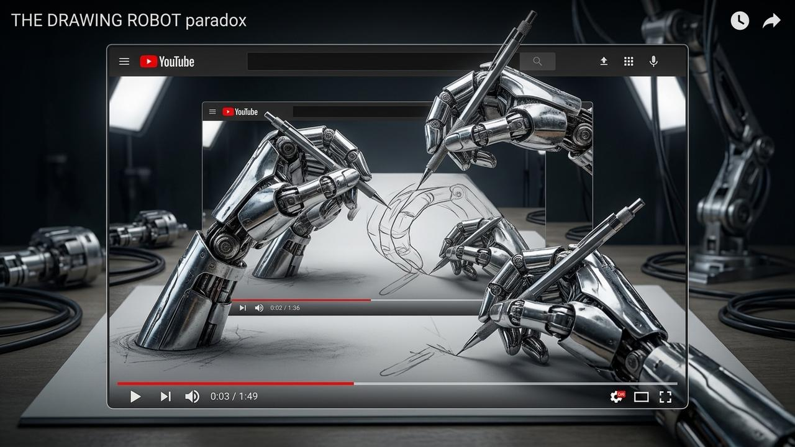

# My AI Skill Edited This Video That Explains My AI Skill

These are amazing times in AI. I just created an automated video editing tool – and the walkthrough at the end of this post was edited by the tool I created. Here's how I did it.

{ align=center width=100% }

<!-- more -->

It started with a video: [_Building an AI Agent to Edit Your Videos_](https://www.youtube.com/watch?v=QVDGtKX3IPY) with Hamel Hussein and Shaw Talebi. They describe a process for AI-assisted video editing, and I was inspired enough to try to replicate it – but using a _very_ meta process. Rather than building the thing myself, I told my Cursor agent to watch their video and figure out how to make effectively the same thing locally.

The agent started by pulling down the transcript using `yt-dlp` – a great tool to know about, by the way. You can use it to download YouTube videos and their transcripts. Once it had the transcript, I told it to read through and set up a repo that replicated the process as best it could. I also told it to package everything up as an agent skill using the `create-skill` skill. (_Everything is **so** meta these days!_) It chugged away for a few minutes, and when it came back, the only thing left on my plate was setting up an AssemblyAI API key.

[AssemblyAI](https://www.assemblyai.com/pricing) turns out to be a great find. It's a speech-to-text service that, crucially, preserves your mistakes – the ums, the uhs – and provides accurate start and stop timestamps for every single word. That timing is the thing that makes automated cutting possible. It's also easy to try: you get around 185 hours of free pre-recorded transcription just for signing up. So of course _I signed up!_

I uploaded a video of myself talking to my camera, told it to do the works – transcribe it, cut the silences, remove the ums and uhs – and it worked... mostly. The problem was that it was clipping the end of every word at the cut point. So, not usable video, but it was amazing to me that it was actually as good as it was.

For my second attempt I gave it the same task but flagged the clipping issue and asked it to figure out what was going wrong. It came back with some ideas and asked what I wanted to do. I said "do what you think is best." 🤣 (This was just supposed to be a side project, so code quality isn't my biggest concern on this one.) It ran for about 30 more seconds, I put the next video through, and the results were not bad – actually pretty impressive for about five minutes of total investment.

Which brings us here. My third attempt was the walkthrough – me on camera in OBS explaining how I built the editing suite. (Again, I don't really know how OBS works, but I asked an AI for pointers and it got me going well enough to fake it.)

**Auto-edited**

  <iframe style="width: 100%; height: 100%;" src="https://www.youtube.com/embed/oV9AMnDuiec" title="My AI Skill Edited This Video That Explains My AI Skill" frameborder="0" allow="accelerometer; autoplay; clipboard-write; encrypted-media; gyroscope; picture-in-picture" allowfullscreen></iframe>

**Original, unedited**

  <iframe style="width: 100%; height: 100%;" src="https://www.youtube.com/embed/sM4cdc6mEE4" title="My AI Skill Edited This Video – Original Unedited" frameborder="0" allow="accelerometer; autoplay; clipboard-write; encrypted-media; gyroscope; picture-in-picture" allowfullscreen></iframe>

The top video is the auto-edited walkthrough – the one where I explain how the tool works, edited by the tool itself. The bottom is the same recording before editing. I was reading from a script and pausing a lot. The difference is striking.

If you want to try this yourself, the skill is in <a href="https://github.com/arcturus-labs/video-editing" data-gated>this repo</a>. Fair warning: it's raw. By default the skill exports to Final Cut Pro, though if you ask it to just stitch the clips together directly it'll do that instead. Also, the way it manages files for each video project is a bit quirky. But the core idea works, and that's the point. Grab it, play with it, make it your own – a copy of a copy – just like I made mine from Shaw Talebi's approach my own.

This post, by the way, was semi-automated from the transcript of the edited walkthrough above. I think I'll write another recursive blog post about that approach too!
