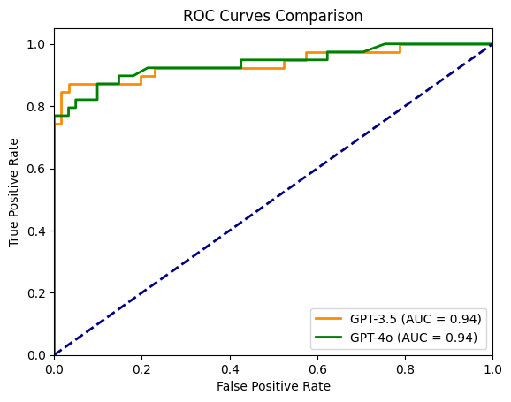
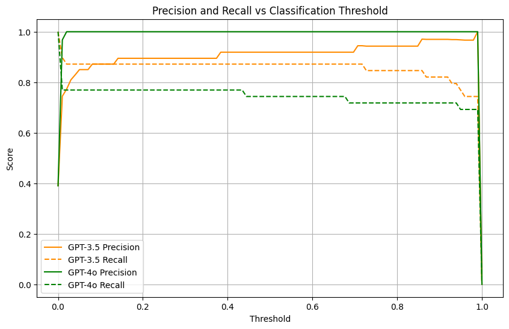
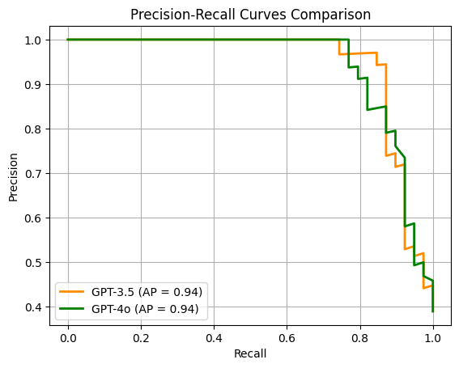

<!-- TODO! make a better name - something that names the technique so that others can refer to it - LogProb Classifier? -->
<!-- TODO! show Jay and Maarten this (and see if they'll repost) -->
<!-- TODO! reread and fix any problems - maybe toss to LLM -->

I was reading the classification chapter of Jay Alammar and Maarten Grootendorst's excellent book [Hands-On Large Language Models](https://amzn.to/4lfynRy). I felt inspired to extend their work and show yet another cool trick you can do with LLM-based text classification. In their work they demonstrated how an LLM can be used as a "hard classifier" to determine the sentiment of movie reviews. By "hard" I mean that it gives a concrete answer, "positive" or "negative". However, we can do one better! Using _this one simple trick_ we can make a "soft" classifier that returns the probabilities of each class rather than a concrete single choice. This makes it possible to _tune_ the classifier – you can set a threshold in the probabilities for deciding the sentiment. This will allow you to make trade-offs between precision and recall depending on which of these two are more important for your application.

<!-- more -->

## Building the "Hard" LLM Classifier
To quickly repeat/paraphrase the work of Hands-On Large Language Models, here's how to build a sentiment classifier using an LLM.

1. Create a prompt that explains the task: "Find the sentiment of this movie review."
2. Add in the text to be classified.
3. Explain the output format for the classification: "Please say only 'positive' or 'negative' and no other words or explanations."

Here's how we could couch this inside of a function:

```python
def get_sentiment(text, model):
    messages = [{   
        "role": "user",
        "content": f"""Read the following text and tell me if the sentiment is positive or negative: 
        
        > {text}
        
        Just say 'positive' or 'negative' (lowercase - no other text - no quotes no words besides positive or negative)""",
    }]

    response = client.chat.completions.create(
        model=model,
        messages=messages,
        max_tokens=1,
        temperature=0.7,
    )

    return response.choices[0].message.content
```

Let's use it a couple of times:

```python
get_sentiment("this sucks", "gpt-4o-mini") # <- negative
get_sentiment("it's awesome", "gpt-4o-mini") # <- positive
```

Perfect.

Let's try one more time:

```python
get_sentiment("this sucks, it's awesome", "gpt-4o-mini") # <- positive
```

Positive? Really? I mean, surely there's some nuance to that, right? Let's try it again a few more times – click, click, click – and we get another 2 positives and a negative. So there _is_ nuance. But how can we understand what the nuance is? How can we take advantage of this?


## Turning it into a "Soft" Classifier
The solution is obvious, right? If you run the classifier several times, then the ratio would eventually converge to the true value, and we would have our soft classifier. But the problem with this solution is just as obvious – how many times do you have to run the classifier before it converges on the correct solution? The answer... lots. And I ain't got that kind of time or money.

But would you believe that you can get the _exact_ probabilities in a single LLM completion request? You can, but first you need to read cool info box about logprobs.

!!! note "Cool Info Box About Logprobs (or "the Lies We Tell Ourselves")"

    When an LLM makes a completion, it doesn't just magically come back with the text all at once. That's a lie. Instead, it looks at the prompt and generates a single token, and then this token gets appended to the prompt and the calculation happens all over again. And one token at a time, the completion is calculated.

    But this is _also_ a lie. Because the LLM doesn't really come up with the next token. It's actually a 2-step process. First the LLM looks at the prompt, and rather than predicting the next token it _actually_ comes up with a long list of probabilities for every possible next token. For instance, gpt-4o has roughly 100K next tokens – if you prompt it with "Today's weather is" then every possible next token is associated with a probability. Among them will be "sunny", "cloudy", "hot", "cold", "rainy", all with reasonably high probabilities. But there will also be all the other tokens "pickle", "manly", "dance", "even" most with infinitesimally small probabilities. And if you summed up all the probabilities, they would add up to 1.0 – that is, there's a 100% chance that one of these tokens will be the next token - nothing less, nothing more.

    There is one more complexity to cover. (Yes, this was another lie.) Each token is actually associated with a "logprob" rather than a probability - that is, the logarithm of the probability rather than the actual probability. Why? It's just easier computationally. It's also no big deal – you can convert from logprobs to probabilities by taking the exponent of the logprob.

    Oh... yeah, and all of that was a lie too. If you _really_ want to know what's happening inside the LLM, I recommend you again to [Hands-On Large Language Models](https://amzn.to/4lfynRy) – in particular, chapter 3. But my explanation here is sufficient for now.

With that knowledge in hand, here is how to extend the hard classifier above to make our soft classifier. First you have to follow the exact same steps above to make the hard classifier. But for the request, you ask for the logprobs to be returned. You don't want the probabilities of all ~100K tokens, but 10 or so should be enough. Then, when you get the completion back, you extract the logprob for each of the possible next tokens and convert them into probabilities.

Let's take a look at the implementation:

```python

def get_sentiment(text, model):
    messages = [{   
        "role": "user",
        "content": f"""Read the following text and tell me if the sentiment is positive or negative: 
        
        > {text}
        
        Just say 'positive' or 'negative' (lowercase - no other text - no quotes no words besides positive or negative)""",
    }]

    response = client.chat.completions.create(
        model=model,
        messages=messages,
        max_tokens=1,
        temperature=0.7,
        logprobs=True, # this instructs the model to return the logprobs for each token returned
        top_logprobs=10, # this further instructs the model to return the top 10 logprobs, not just the one selected
    )

    # Extract top logprobs and convert to probabilities
    logprobs_list = response.choices[0].logprobs.content[0].top_logprobs # we only care about the first token in the completion
    token_probs = {
        # item.token is the text of the token - "positive", "negative", or something else
        # math.exp(item.logprob) is the probability of that token
        item.token: math.exp(item.logprob)
        for item in logprobs_list
    }

    # for the sentiment classification, I only care about the probability of 'positive' and 'negative'
    # but I'm lumping the probability for all other possible tokens into "other"
    pos_prob = token_probs.get('positive', 0)
    neg_prob = token_probs.get('negative', 0)
    other_prob = 1 - (pos_prob + neg_prob)

    return {'positive': pos_prob, 'negative': neg_prob, 'other': other_prob}
```

To see how it works, let's run this sentiment classifier with the problematic example from above:

```python
get_sentiment("this sucks - it's awesome", "gpt-4o-mini")

# response
# {'positive': 0.5621647747752282,
# 'negative': 0.4378143668101077,
# 'other': 2.085841466414884e-05}
```

There's our nuance! Before, we ran the hard classifier 4 times and found that it was positive 75% of the time and negative 25% of the time. But with the hard classifier it would be impossible to have an accurate estimate without running the classification many, many times. But if you did run it hundreds, thousands, millions of times, then eventually the hard classifier would converge to the exact probabilities above: positive 56.2% of the time negative 43.8% of the time, and some other token a tiny fraction of the time.

## Experiment
Let's take a look at some of the tricks we can do with our new soft classifier. Again taking the lead of [Hands-On Large Language Models](https://amzn.to/4lfynRy) I'm using the popular [Rotten Tomatoes dataset](https://huggingface.co/datasets/cornell-movie-review-data/rotten_tomatoes) as my example. 

```python
import pprint
from datasets import load_dataset

dataset = load_dataset("cornell-movie-review-data/rotten_tomatoes", split="train")
dataset = dataset.shuffle() # shuffle it because the data set is organized as 2 chunks, positive reviews, then negative reviews
dataset = list(dataset)[:100] # using just a subset for demonstration

pprint.pprint(dataset[:5])
```

returns

```
[{'label': 1,
  'text': 'there is no substitute for on-screen chemistry , and when friel '
          'pulls the strings that make williams sink into melancholia , the '
          'reaction in williams is as visceral as a gut punch .'},
 {'label': 1,
  'text': "michael moore's latest documentary about america's thirst for "
          'violence is his best film yet . . .'},
 {'label': 0,
  'text': 'yes , one enjoys seeing joan grow from awkward young woman to '
          'strong , determined monarch , but her love for the philandering '
          'philip only diminishes her stature .'},
 {'label': 0,
  'text': 'the movie slides downhill as soon as macho action conventions '
          'assert themselves .'},
 {'label': 0,
  'text': 'an unpredictable blend of gal-pal smart talk , romantic comedy and '
          'dark tragedy that bites off considerably more than writer/director '
          'john mckay can swallow .'}]
]
```

Now let's get the sentiment for all 10 reviews.

```
sentiment_probs = []
for review in list(dataset)[:100]:
    prediction = get_sentiment(review['text'], model='gpt-4o-mini')
    sentiment_probs.append({
        'prediction': prediction,
        'review': review,
    })

sentiment_probs_4o = sentiment_probs
```

And for funsies, let's also do this for `gpt-3.5-turbo-1106` and store it in `sentiment_probs_35`.
<!-- TODO! for each of these write a paragraph about what these are -->
With this data in hand we can plot the ROC curve and calculate the area under the curve (AUC) for our new soft classifier:

<figure markdown="span">
  { width="600px" align=left}
  <figcaption>ROC plot showing the false-positive vs true-positive rates for different threshold probabilities for "positive" sentiment</figcaption>
</figure>

??? note "Code used to generate the above plot"

    ```python
    from sklearn.metrics import roc_curve, auc
    import numpy as np
    import matplotlib.pyplot as plt

    # Calculate ROC curves for both models
    y_true_35 = [pred['review']['label'] for pred in sentiment_probs_35]
    y_scores_35 = [pred['prediction']['positive'] for pred in sentiment_probs_35]
    y_true_4o = [pred['review']['label'] for pred in sentiment_probs_4o]
    y_scores_4o = [pred['prediction']['positive'] for pred in sentiment_probs_4o]

    # Calculate ROC curves
    fpr_35, tpr_35, _ = roc_curve(y_true_35, y_scores_35)
    fpr_4o, tpr_4o, _ = roc_curve(y_true_4o, y_scores_4o)

    # Calculate AUCs
    roc_auc_35 = auc(fpr_35, tpr_35)
    roc_auc_4o = auc(fpr_4o, tpr_4o)

    # Plot
    plt.figure()
    plt.plot(fpr_35, tpr_35, color='darkorange', lw=2, label=f'GPT-3.5 (AUC = {roc_auc_35:.2f})')
    plt.plot(fpr_4o, tpr_4o, color='green', lw=2, label=f'GPT-4o (AUC = {roc_auc_4o:.2f})')
    plt.plot([0, 1], [0, 1], color='navy', lw=2, linestyle='--')
    plt.xlim([0.0, 1.0])
    plt.ylim([0.0, 1.05])
    plt.xlabel('False Positive Rate')
    plt.ylabel('True Positive Rate')
    plt.title('ROC Curves Comparison')
    plt.legend(loc="lower right")
    plt.show()
    ```

<!-- TODO! for each of these write a paragraph about what these are -->

Another useful way of looking at our classifier is through the lens of precision and recall. For this particular data set, there is an equal number of positive and negative reviews. But precision and recall are useful metrics if our dataset had a class imbalance or especially if one of the classifications is considered much more important to get right than the other. For instance, if you are classifying purchase transactions to identify fraud, then the number of occurrences of fraud is a tiny fraction of the total number of transactions, so one way to make your classifier really "accurate" is to just classify everything as _not_ fraudulent. But naturally, this defeats the purpose. Instead, you'll want to find a good balance between recall – finding as man occurrences of fraud as possible – and precision – making sure that the transactions labeled as fraud are indeed fraud.

<figure markdown="span">
  { width="600px" align=left}
  
  <figcaption>Precision vs. recall at various threshold values.</figcaption>
</figure>

??? note "Code used to generate the above plot"

    ```python
    from sklearn.metrics import precision_score, recall_score

    # Calculate precision and recall at different thresholds for both models
    precision_scores_35 = []
    recall_scores_35 = []
    precision_scores_4o = []
    recall_scores_4o = []

    for threshold in thresholds:
        predictions_35 = [1 if score > threshold else 0 for score in y_scores_35]
        predictions_4o = [1 if score > threshold else 0 for score in y_scores_4o]
        
        precision_scores_35.append(precision_score(y_true_35, predictions_35))
        recall_scores_35.append(recall_score(y_true_35, predictions_35))
        precision_scores_4o.append(precision_score(y_true_4o, predictions_4o))
        recall_scores_4o.append(recall_score(y_true_4o, predictions_4o))

    # Plot
    plt.figure(figsize=(10, 6))
    plt.plot(thresholds, precision_scores_35, 'darkorange', linestyle='-', label='GPT-3.5 Precision')
    plt.plot(thresholds, recall_scores_35, 'darkorange', linestyle='--', label='GPT-3.5 Recall')
    plt.plot(thresholds, precision_scores_4o, 'green', linestyle='-', label='GPT-4o Precision')
    plt.plot(thresholds, recall_scores_4o, 'green', linestyle='--', label='GPT-4o Recall')
    plt.xlabel('Threshold')
    plt.ylabel('Score')
    plt.title('Precision and Recall vs Classification Threshold')
    plt.grid(True)
    plt.legend()
    plt.show()
    ```

Maybe a better way to look at this data is to just plot the precision vs the recall – same data, just a different representation. This shows the trade-off between precision and recall.

<figure markdown="span">
  { width="600px" align=left}
  
  <figcaption>Precision vs Recall for all possible threshold values.</figcaption>
</figure>

??? note "Code used to generate the above plot"

    ```python  
    from sklearn.metrics import precision_recall_curve, average_precision_score
    import matplotlib.pyplot as plt

    # Calculate Precision-Recall curves for both models
    precision_35, recall_35, _ = precision_recall_curve(y_true_35, y_scores_35)
    precision_4o, recall_4o, _ = precision_recall_curve(y_true_4o, y_scores_4o)
    avg_precision_35 = average_precision_score(y_true_35, y_scores_35)
    avg_precision_4o = average_precision_score(y_true_4o, y_scores_4o)

    # Plot
    plt.figure()
    plt.plot(recall_35, precision_35, color='darkorange', lw=2,
            label=f'GPT-3.5 (AP = {avg_precision_35:.2f})')
    plt.plot(recall_4o, precision_4o, color='green', lw=2,
            label=f'GPT-4o (AP = {avg_precision_4o:.2f})')
    plt.xlabel('Recall')
    plt.ylabel('Precision')
    plt.title('Precision-Recall Curves Comparison')
    plt.legend(loc="lower left")
    plt.grid(True)
    plt.show()
    ```      

For instance, if you want to get the recall greater than 95% then the precision for both GPT-3.5 and GPT-4o then there's no way with these models and this prompt to get precision higher than about 50%. (Again, this particular model is predicting positive reviews, but if this had been predicting fraudulent transactions, then precision and recall would be a good set of metrics to consider.)

## Making Your Own Classifier

This example implementation was for sentiment analysis, but your implementation can be for anything you want. Here are some ideas and tips for your own implementation:

- Sentiment analysis only has 2 options "positive" or "negative", but your implementation could have many more. For instance, you could make a tech support classifier that classifies emails into the portion of the product that is being discussed.
- Sentiment analysis requires almost no explanation, but your classifier could incorporate a prompt with considerable explanation and several examples. It could even employ chain-of-thought or reasoning prior to declaring its final answer. What's more, you can use some of the metrics described above (like AUC) to compare classifier prompts and find prompts that serve as better classifiers.
- Notice that in the above implementation I was keeping track of the probability associated with "other" tokens besides "positive" and "negative", this is because some particularly unusual movie reviews can make the classifier jump to a token besides "positive" and "negative" - for instance a "neutral" review which is actually just a description of the movie without any particular sentiment. A better classifier would take this into account. There are several options here:
    1. You can normalize the probabilities so that prob("positive") and prob("negative") sum to 1.0 and ignore the other tokens.
    2. You can listen to what the LLM is trying to tell you – catalog the other tokens being referred to and incorporate them into new classifier with more options.
    3. Add an explicit "none of the above" option.
- Whenever you implement a "soft" classifier make sure that each of the classes you select are single tokens. For instance, "positive" and "negative" are tokens, but if "positive" was two tokens "pos" and "itive", then this technique wouldn't work - at least not without some extra considerations. One easy way to get around this is to use numbered options for your classes. Every number from 1 to ????? is a unique token <!-- TODO! double check and finish this sentence -->

## Conclusion
<!-- TODO! make conclusion : "you can make your own classifier quite easily" and "read their book" -->