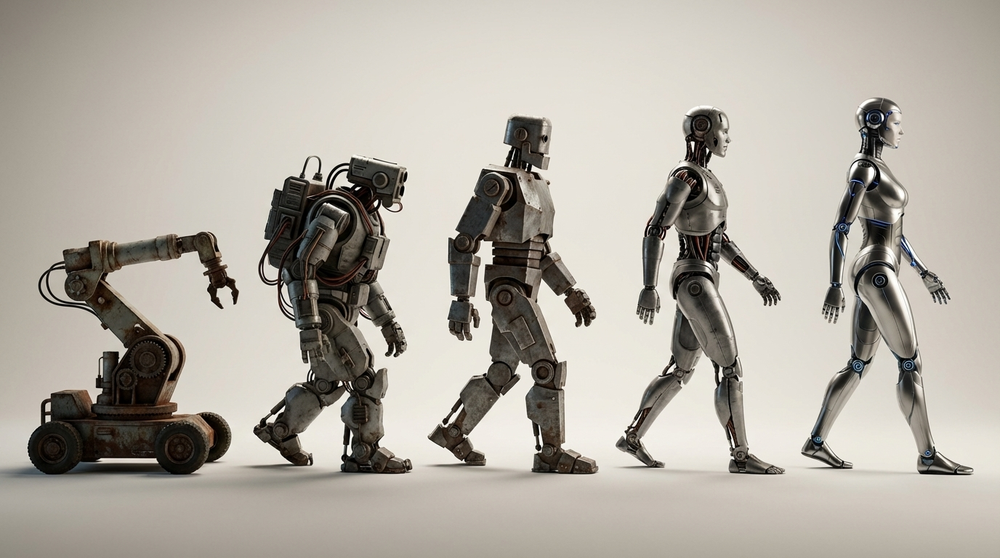
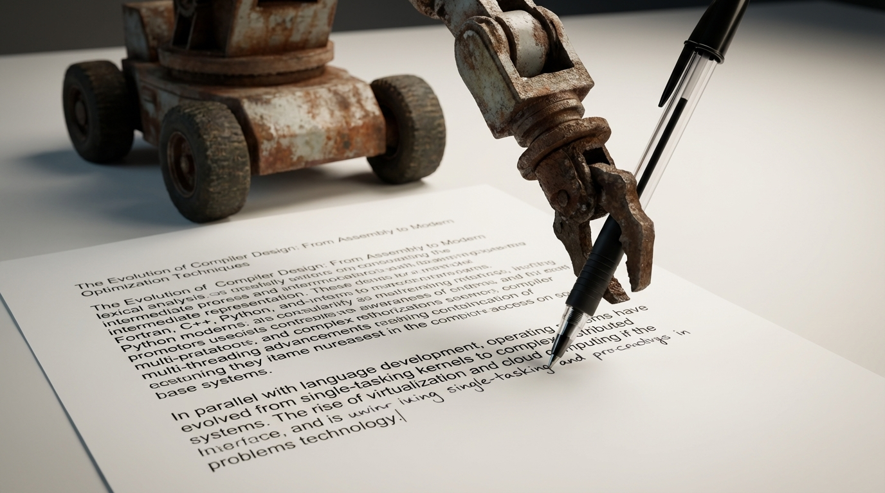
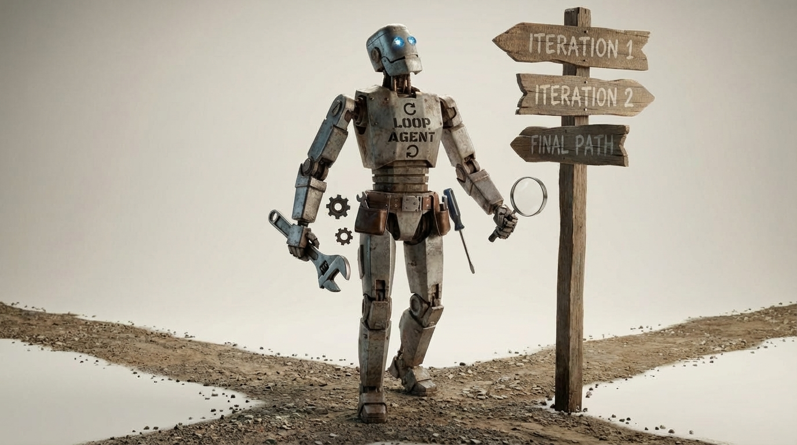

# The AI Product Era You're Building For Might Already Be Over

At the end of 2022, ChatGPT launched and immediately set records as the fastest-rising consumer product of all time. It gave us a glimpse of something genuinely alien. Humans are special - we make tools. But for the first time ever, we made a tool that could speak back.

Since then, we've seen several eras of growth. Ideas and approaches have come and gone as we've tried to figure out how to actually use this thing. With every era, the good ideas of the last are trained into the models, incorporated into their APIs, encoded as best practices, and often obscured by a new layer of abstraction.

We are now at the beginning of a new era - and this one is going to make the earlier ones look like a warm-up act.

In this post I'll walk through the history of AI product development, the present revolution, and what might be coming next. If you're building AI products, you need to understand this trajectory: to avoid building things that get immediately disrupted, to build things that hold up over time, and to take full advantage of what the technology can actually do.

{ align=center width=100% }

<!-- more -->

## 2022 – Document Completion and the Era of Prompt Engineering

In the beginning was the Prompt.

I was an early product engineer for GitHub Copilot - you remember it, right? You'd start typing in your editor and it would complete whatever was in front of your cursor. Copilot was the purest expression of what the underlying technology actually was at that point: a document completion engine.

Think of the early models as being similar to the autocomplete on your iPhone when you're composing a text message – it reads your text so far and suggests the next word. Large language models of this era did the same thing except that they were trained on a vastly larger corpus – essentially all publicly available text on the internet, and therefore much more accurate. Given a scrap of text, they would find the statistically most likely next word, then the next, then the next. Do that enough times and you've completed the document.

{ align=center width=100% }

Because the training data included enormous amounts of code, and because code is more structured and predictable than human speech, these models turned out to be fantastic for code completion. Copilot was the first killer app of the AI era, and it was built on this simple trick.

But the models were clumsy. Getting them to produce anything reliably useful required a collection of workarounds – tricks really. These tricks were collectively called *prompt engineering*.

**Few-shot examples.** The GPT-3 paper, ([Brown et al., 2020](https://arxiv.org/abs/2005.14165)), was the landmark that put this on everyone's radar. LLMs are pattern matchers. If you asked the model "What is the capital of Belarus?" then rather than just telling you the answer, the model would see a pattern - questions about capitals – and it would continue:

```
What is the capital of France?
What is the capital of Japan?
What is the capital of Australia?
What is the capital of Canada?
What is the capital of Egypt?
What is the capital of Brazil?
What is the capital of Sweden?
```

The fix was to prime it with a few examples first and _then_ ask the question that you really wanted answered:

```
What is the capital of Spain? Madrid.
What is the capital of Italy? Rome.
What is the capital of Germany? Berlin.
What is the capital of Belarus?
```

"Minsk!"

**Chain-of-thought reasoning.** If you ended the setup portion of your prompt with "Let's think step by step," ([Wei et al., 2022](https://arxiv.org/abs/2201.11903)) the model would work through its reasoning before answering - and the answer was usually better for it.

Without chain-of-thought:
```
Q: If you have one bucket that holds 2 gallons and another bucket that holds 5 gallons, how many buckets do you have?
A:
```

"There are 7 buckets!"

With "Let's think step by step":
```
Q: If you have one bucket that holds 2 gallons and another bucket that holds 5 gallons, how many buckets do you have?
A: Let's think step by step.
```

The model would then think out loud which effectively provided more context to reason over and the result would often be a better answer. In this case the continuation might read "The question is asking how many buckets there are, not how many gallons they hold. There is one bucket plus another bucket. Therefore, the answer is 2."

**ReAct.** Researchers figured out you could describe hypothetical tools in the prompt - search engines, calculators, etc. - and the model would attempt to "call" them ([Yao et al., 2022](https://arxiv.org/abs/2210.03629)).

```
User: Which city is warmer right now, Boston or Miami?

Thought: I should check the current weather for both cities.
Action: get_weather("Boston")
Observation: 48 F
Action: get_weather("Miami")
Observation: 81 F

Answer: Miami is warmer right now.
```

**Chat.** Possibly the silliest trick: you can craft a document that opens with "The following is a transcript between a brilliant assistant and a user," provide a few fake exchanges, and the model would keep the transcript going. If the end of the document had the text "assistant: " then the model would be obliged to complete the text of the assistant. You would just need to make sure that you stopped the completion if you saw the text "user: " because that would be the model fabricating the entire rest of the conversation. You could then show the real human user the assistant response, allow the human to make their own reply, and incorporate that into the growing transcript – thus chat was born.

```
The following is a transcript between a brilliant assistant and a user.

assistant: How can I help you today?
user: Write a polite reply declining a meeting because I'm traveling.
assistant:
```

The model would simply continue the transcript with something like:

```
Of course - here's a polite reply:

"Thanks for the invitation. I'll be traveling that day and won't be able to make it, but I'd be glad to reconnect afterward."
```

I was playing with all of these things in 2022. I even wrote an interview coding challenge at GitHub that asked engineers to build a working chat assistant using only document completion - [here's it is](https://gist.github.com/JnBrymn/bcd0e1edcc6d8c310b889d0cd0e43565) if you want to try it.

Albert Ziegler (a founding research engineer on Copilot) and I documented this era's hard-won tricks in our O'Reilly book, [*Prompt Engineering for LLMs*](https://amzn.to/4gChsFf).

## 2023 – The Chat and Tool-Calling Revolution

{ align=center width=100% }

This is also where the defining meta-pattern of AI development first became clear: whatever the prompt engineers figure out in one era gets aggressively fine-tuned into the models and folded into the APIs of the next.

ChatGPT launched in November 2022 and institutionalized the transcript trick. The jump in usefulness was immediate. Rather than coaxing answers out of a completion engine, you could hold a real conversation – the model stayed on topic, remembered what was said, responded to corrections. Much easier to direct.

Then in May 2023 OpenAI fine-tuned models to interact with tools, baking in the ReAct pattern. Accuracy was shaky at first, but the move was huge: the models now had eyes to read data outside the prompt, and hands to act on the world. Under the hood it was still document completion – the document just grew to accommodate tool calls and their responses.

## 2024 – Workflows Put LLMs on Rails

{ align=center width=100% }

By now you could string LLM calls together and hand a model a set of tools. The temptation was to just let it run in a loop. The problem: given that much freedom, models would wander off task and start making things up.

The answer was workflows – treating each LLM call as a node in a directed graph, with defined inputs and outputs. Rather than one long improvised session, you broke complex jobs into discrete steps. Workflows kept the work on the rails and made it possible to get real results on hard tasks.

RAG was also a dominant theme in 2024, but I'll admit I never quite understood the fuss. RAG is just LLMs combined with a search tool. If retrieval is broken, there are 30 years of industry knowledge on how to fix it (buy [*Relevant Search*](https://amzn.to/3TXmDHk)). If the LLM isn't behaving, fix that too (buy [*Prompt Engineering for LLMs*](https://amzn.to/4gChsFf)). There's no reason to treat RAG as a black box – it's a pipeline.

## 2025 – The Agent Awakes

{ align=center width=100% }

In February 2025, at the AI Engineering conference, Grace Isford of Lux Capital [declared that this would be the year of agents](https://www.youtube.com/watch?v=HS5a8VIKsvA). She was right - but the real accomplishment of 2025 was just agreeing on what an agent actually was.

The term was a mess. Some teams were making a single LLM request to extract structured data from a webpage and calling that an agent. Some said workflows were a form of agency - I'll admit I made that mistake in my own book. But "agency" has a straightforward definition in the dictionary: _the ability to make decisions and act independently_. A single LLM call, a chain, or a workflow isn't acting under its own agents, it's just doing what it's told, with the decision points happening algorithmically.

The winning paradigm turned out to be simple: a for loop, with callouts to the LLM and tools. You give it a task, and _it decides_ how to proceed - which tools to call, what to do with the results, when it's done. Whether or not LLMs have a genuine _will_ is a philosophical quibble, but this at least meets the functional definition of agency. And if you want your agent to behave like an assistant, you just add another loop around the outside and keep appending the user's messages to the context.

One thing that pushed the field toward a clear answer was the arrival of reasoning models. OpenAI introduced them in late 2024, then DeepSeek-R1 showed up in January 2025 and stole the show - comparable reasoning quality at a tiny fraction of the cost. For loop-based agents, which need a model that can stay oriented over many steps, this mattered a lot.

That said, the early agents were pretty useless. Keeping a loop on task was hard, and the models weren't reliable enough to be trusted with anything consequential. But reasoning steadily improved throughout the year, and by late 2025 several observers independently called out a step-change improvement in agent capability.

!!! note "The November 2025 inflection point"

    Several prominent observers independently called out the same moment.

    **[Andrej Karpathy](https://twitter.com/karpathy/status/2026731645169185220):** "Coding agents basically didn't work before December and basically work since - the models have significantly higher quality, long-term coherence and tenacity and they can power through large and long tasks."

    **[Simon Willison](https://simonwillison.net/2026/Jan/4/inflection/):** "GPT-5.2 and Opus 4.5 in November represent an inflection point - one of those moments where the models get incrementally better in a way that tips across an invisible capability line where suddenly a whole bunch of much harder coding problems open up."

    **[Paul Ford, NYT](https://www.nytimes.com/2026/02/18/opinion/ai-software.html):** "[Claude Code] was always a helpful coding assistant, but in November it suddenly got much better, and ever since I've been knocking off side projects that had sat in folders for a decade or longer."

    **[Max Woolf](https://minimaxir.com/2026/02/ai-agent-coding/):** "It's impossible to publicly say [the models] are an order of magnitude better than coding LLMs released just months before without sounding like an AI hype booster clickbaiting, but it's the counterintuitive truth."

By the end of 2025, the agentic frameworks were also converging. The main ingredients - agent instructions, tools, memory - had settled into recognizable patterns across the major platforms. Subagents were still a rough edge: coordinating context between them without stomping on each other's work was fiddly. But a good first-order approximation is to just treat a subagent as a tool that happens to use an LLM internally - the main agent doesn't need to know or care. (Context management for subagents has also been getting easier; a March 2026 leak of Claude Code's internals revealed that subagents receive the full context of the parent agent, which is both information-rich and cache-friendly.)

The big shift in focus from earlier eras: rather than fine-grained prompt engineering tricks, the dominant abstraction in 2025 was context management. What does the agent need to know, when does it need to know it, and how do you keep the context window useful rather than bloated?

## 2026 – The Emerging Agentic Runtime

{ align=center width=100% }

Right now people in the software development world are calling it a "harness" – all the scaffolding that surrounds your agents and runs them: the agentic loop, tool handling, session and context management (compaction, skills, memory), sandboxing, subagent orchestration. Some prominent examples are Claude Code, Codex, Cursor, and OpenCode.

But the harness metaphor is too narrow. We're already seeing it extend beyond code. Claude Cowork and OpenClaw are the most obvious examples – they're essentially coding agent harnesses with more flexible input and output (voice, email, whatever) and less rigid expectations about the work being done. The name "harness" won't stick (I hope).

What we're really seeing is the emergence of an _agentic runtime_. Think of it like a code interpreter – Python takes structured source code and executes it. The agentic runtime takes English and executes _that_, using available tools to get real work done. But unlike a code interpreter, which does exactly what the code says, the agentic runtime understands what you're getting at. It can write its own tools, spin off subagents to parallelize the work, and be genuinely creative in how it solves your problem.

The key new development that makes this click – in my opinion – is [agent skills](https://docs.anthropic.com/en/docs/claude-code/skills), introduced by Anthropic in October 2025. On the surface, skills are a ridiculously simple idea: a folder with a `SKILL.md` that acts as a README for a specialized task, with optional subdirectories, explanatory markdown, and runnable scripts. You tell the runtime to use skills as needed, and it does.

But it's deeper than that. Anthropic realized its models – and the frontier models generally – have become very good at navigating filesystems, working at a command line, and using an operating system. Skills leverage these familiar constructs, giving agents a natural leg up compared to arbitrary tool APIs for which the model has no trained-in intuition.

If English is the new programming language and the agentic runtime is the new interpreter, then the agent skill is the program itself. I've already written powerful programs with agent skills – including [building a simple OpenClaw clone in 15 minutes](../openclaw_clone_in_15_minutes.md). And there are now places online where you can download skills like software libraries, because that's basically what they are – with package management systems starting to appear to manage them.


## What's Coming Next

{ align=center width=100% }

We're still in the early days of the agentic runtime. And like all eras before, the good ideas will get fine-tuned into the models, added to the APIs, and formalized into standards. Here are my guesses for what comes next.

**Context management gets standardized.** The frontier labs will find increasingly efficient automatic approaches for memory extraction, context compaction, and progressive disclosure of skills and tools. Eventually this gets trained into the models and they just do the right thing. For a hint at how this might work, see my post on [infinite compaction](../infinite_context_compaction.md).

**Skills become products.** We'll start to see skills packaged as standalone offerings that run in your agentic runtime of choice. ("Are you an Anthropic man, Stan?") They'll be open source by default, because it's hard to close-source English, but they won't necessarily be free. This creates interesting IP questions: skills are modifiable by design, so what does ownership even mean when anyone can edit your "program" to match their preferences?

**Agents start learning on the job.** Right now an agent is defined by its instructions – its skills, its tools, its context. But continuous learning is coming. Agents will be able to learn the nuances of their jobs through trial, error, and correction, just like us meat computers. When that happens, an agent becomes something more than the sum of its instructions.

**Embodied cognition arrives.** Increasingly capable world models (like [Google DeepMind's Genie 3](https://deepmind.google/blog/genie-3-a-new-frontier-for-world-models/)) and a renewed interest and development in robotics are setting us up for agents that don't just act in software – they act in the physical world. And I, for one, am tired of folding laundry! However, I'm not really looking forward to the kill-bots that filled 80's sci-fi movies.

**Orchestration escapes the agentic harness.** We went from handcrafted workflows to loose English prose in skills files, with the agent deciding when to spin up subagents. The next step is higher-level workflows at the scale of an entire business – decoupled agents with their own roles, goals, and tools, communicating through loosely defined interfaces. My bet for what that interface looks like? Email – there's plenty of it in the training data. And to make everything even more sci-fi, _you'll_ be one of the agents in that network, sometimes orchestrating, sometimes doing QA on agent decisions, sometimes serving as the subject matter expert where agents don't yet pass muster.

Agents will be the building block for everything going forward. "Programming" them will be as simple as giving them the skills they need and the tools to do the job – tools they may well just build themselves. High-level orchestration is probably the next hard frontier.


## Conclusion: Build for What's Coming

When Albert and I wrote [*Prompt Engineering for LLMs*](https://amzn.to/4gChsFf), we told O'Reilly that the important abstraction was document completion. That was true – for just about one year. Since then, several eras have stacked on top of it, each retaining the previous abstraction, but burying it under a new, more powerful layer. The agentic runtime is just the latest.

It's hard for me to provide general advice without knowing what you are specifically building, but one intuition has held up through every era: cognitive empathy. I don't mean the warm-fuzzy kind of empathy – emotional empathy – I mean the practical kind: you need to put yourself in the shoes of both the agent _and_ the user and ensure that they each have what they need.

For the agent – treat it like a capable intern. Does it have the instructions, context, and tools, that it needs? Can it actually understand them? If the answer is yes, increasingly it will deliver the desired results. Lean into constructs that agents already know. Right now that means filesystems and the command line. Soon it might mean something like email.

 For the user – people working with an AI system need to understand what it's doing. The conversation needs to stay separate from the objects being worked on (see [my artifacts post](cut-the-chit-chat-with-artifacts.md) for more). The agent's reasoning should be visible, auditable, and redirectable so that the user can see what's happening, correct the agent when it goes off track, and teach it how to navigate similar problems in the future.

The other piece of advice: try to see the technological trajectory, not just this current snapshot. Whatever is dominating the news cycle right now isn't the end state – but if you look back, the direction has been remarkably consistent. Try to project it forward. A few things I'm confident about: English is already a runnable software language. Agents are the worst that they will ever be going forward because the technology is still on an exponential upswing. The agent behavior that seems laughable today will soon be replaced by very adept handling of the same situations. Everyone will eventually have a personal agent at their disposal (which is really a legion of agents). And the internet as we know it today will give way to something built for agents – a place for them to retrieve data and interact with APIs. And it will be the role of the agents to provide us humans with highly personalized interfaces as we need them.

It's a brave new world. Make the most of it.
