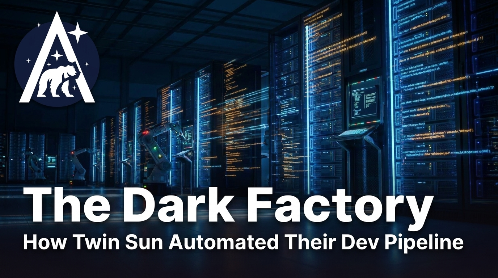

# The Dark Factory: How Twin Sun Automated Their Entire Dev Pipeline

Twin Sun's automated code reviewer currently approves about 70% of pull requests on its own. No human reviews those PRs. No human sees that code until it's already merged.

This isn't a prototype. It's running in production across their client projects. How did a Nashville software agency get here, and what would it take for your team to do the same?

{ align=left width=100% }

<!-- more -->

!!! note "More of a watcher than a reader?"

    I sat down with Dave Lane (CEO) and Jami Couch (CTO) of Twin Sun for a conversation about all of this. Check out the full video below.

    <figure markdown="span">
      <iframe width="70%" src="https://www.youtube.com/embed/kkvi2Rm-K84" title="The Dark Factory: How Twin Sun Automated Their Entire Dev Pipeline" frameborder="0" allow="accelerometer; autoplay; clipboard-write; encrypted-media; gyroscope; picture-in-picture" allowfullscreen></iframe>
    </figure>

## What Is a Dark Factory?

A dark factory is a software development pipeline where AI agents handle the full cycle – requirements, code, tests, review, rework, merge – with minimal human intervention. "Dark" is borrowed from manufacturing: a lights-out factory runs without people on the floor.

Twin Sun calls their factory Scarif (a Star Wars reference, for the record). But the goal, as Dave frames it, isn't to eliminate developers. It's to "stretch time and budgets by increasing what we can accomplish in the same amount of time or with the same money." The developers are still there – they're just no longer the ones typing out every line.

## Inside Scarif: the Full Pipeline

Scarif starts from a Jira ticket. A prompt is generated from that ticket, a Claude Code worker picks it up, builds a plan, and implements the changes. From there the PR goes to the code review agent – which checks style, architecture, and whether the implementation actually matches the spec. If it passes, the PR is approved and queued for merge. If it fails, it goes back to the development agent automatically. No human is in that loop.

Keeping everything tied to Jira was a deliberate choice. It keeps work visible to both humans and agents, and it means every ticket – whether handled by Scarif or a human developer – moves through the same system. Clients see work move through the system in the same way they always have.

## Principle 1: Build Your Factory, Not *a* Factory

The temptation when building a dev pipeline is to make it general. The appeal is that you only need to do a little in setup. You describe the task in plain language, skip the details, and let the agent figure it out. No thought out guidelines, no templates to maintain.

The problem is that the space of possible things an agent can build when given no constraints is enormous. It picks an approach – and it might be a perfectly reasonable approach – but it's probably not the approach your team uses. Your developers look at the output and can't easily tell if it's good or not, because it's written in a style they're not familiar with. What's more, without guidelines, you 
often end up with a mishmash of patterns: over-elaborate solutions and inconsistent 
architecture.

Jami put his finger on exactly why the alternative works: "We don't have to build a factory that's so general purpose that anyone could use it. We just need one that builds things the way we want them to be built."

Twin Sun made Scarif opinionated in three concrete ways.

**Rules.** The Flutter team published [a long markdown file of best practices for AI agents working with Flutter](https://docs.flutter.dev/ai/ai-rules). Twin Sun took that as a starting point, fed it their actual codebase, and asked Claude to adapt the rules to match how *they* do things. The result: a Twin Sun-specific rule set that gets injected into every Claude Code session. Generated code follows their conventions, not Flutter's defaults.

**Templates.** Twin Sun does a lot of greenfield work. Their base app templates – built up over years – include starting implementations for user management, payments, push notifications, dashboards, and more. When Scarif spins up on a new project, it's not starting from a blank page. It's starting from a codebase that already embodies and exemplifies their historic preferences.

**The codebase as few-shot examples.** When Claude Code implements a new service class, it looks at the service classes already in the project and follows that pattern. This is effectively a form of few-shot prompting – and it happens organically just by having a well-built existing codebase to work from.

The opinionated approach narrows the space of possibilities. Less creative latitude means fewer surprises, and fewer surprises means you can actually trust what comes out.

## Principle 2: Go Darker Gradually

It would be a mistake to design the full factory and flip it on. The right path is: introduce one component, develop it locally first, run it manually, build confidence in its behavior, and only then let it run dark. Rinse, repeat.

The PR reviewer's history is the clearest illustration of this. It started as an optional advisory tool – it would leave comments, developers could read them or ignore them, no authority attached. Over time, as the team understood how it behaved, they gave it more. Eventually they let it approve pull requests on its own. Within a week of enabling that, it was handling 70% of PRs without a human.

Dave makes another useful point here. You don't have to build the factory in the factory. If you're doing local development with Claude Code and getting good results on a certain class of task, that work can be "promoted" into Scarif once you're confident that it's going to work. The factory can grow from the bottom up as well as the top down.

## The Human Side: Team Adoption and Changing Roles

Not every developer is thrilled when an AI starts approving pull requests without them. Twin Sun's experience here was shaped by who they hired. Most of their team are second-career developers – people who came from bartending, teaching, music, biochemistry – who had already made one major career pivot before landing in software. They're used to adapting. A shifting field doesn't feel like a threat in the same way it might to someone who has only ever known one profession.

I loved Dave's emphasis here: the issue isn't that tasks are getting automated, it's whether or not people are focused on code or on outcomes. Developers who care about the outcome – shipping something valuable for the client – stay motivated when the tedious parts get handled by Scarif. Developers who measure their value by the lines they write personally are going to have a harder time in the world we're entering.

Dave put it plainly when asked what roles are on the chopping block: typing out syntax is honestly one of the least valuable things their team does. What they're great at is thinking globally about a project, reasoning about what's actually right for the client, and making strategic decisions. The factory handles the rest.

## The Pattern Beyond Code

The factory pattern doesn't have to be code-specific. Twin Sun has years of accumulated project knowledge – client work, hard-won lessons, interesting technical decisions – almost none of which has ever been written down. Dave floated an idea: have everyone record a short audio interview about their projects and run those through a factory that turns them into case study and blog post drafts. The factory grounds the output in real knowledge; a human does a final pass to make it sound like them. The content gets written; without the factory, it just wouldn't happen.

They haven't built that factory yet. But the underlying principle is the same wherever you apply it: document a human process, systematize it, automate what you can, keep humans in the parts that need them.

!!! note "This post is my own experiment with a content factory!"

    I built a version of this for Arcturus Labs. My goal isn't to generate AI slop – it's to systematically extract value from long-form conversations without losing control of the content or style. The steps:

    1. Watch the video and flag key moments (which I filter and incorporate with my own thoughts)
    2. Organize those moments into a structure (which I review and edit)
    3. Convert the structure into prose (which I revise for tone)
    4. Publish and promote

    This post started as a 70-minute transcript and a set of editing notes. You're looking at the output. If you think it's good, the factory works.

## Start Small, Go Dark Gradually

The dark factory is achievable. But it's not a big-bang project. Twin Sun didn't design Scarif in full and flip it on. They built one piece, ran it manually, watched how it behaved, and only then let it run on its own. Then they built the next piece.

Two things make it work: constrain the factory to your team's actual patterns, and earn trust before removing the human from any given step. The teams that will succeed are the ones who resist the urge to build everything at once and instead go one step at a time – getting gradually, deliberately darker.

---

### Want to go deeper?

- Is your company building toward something like this? [I'd love to hear about it – and I can help you navigate the design and adoption challenges.](/#contact-blog)
- I write regularly about agentic AI and what it looks like in practice. [Subscribe and get new posts as they land.](/#contact-blog)
- Dave and Jami go into much more detail in the full conversation – PR review mechanics, design review challenges, how they get team buy-in, and where they see this going next. [Watch the video.](https://www.youtube.com/watch?v=kkvi2Rm-K84)

