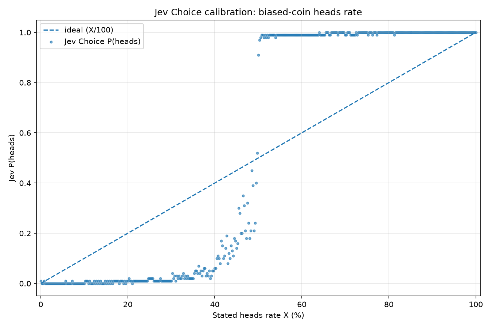
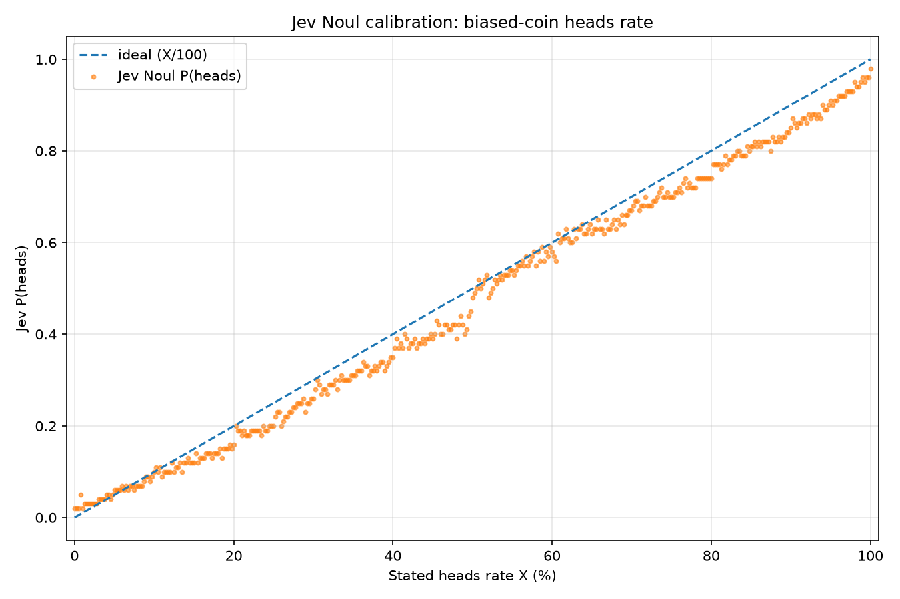

# TypeSafe's Jev Trades Text Generation for Instant, Calibrated Decisions

TypeSafe just announced an exciting new take on LLM called [Jev](https://typesafe.ai/blog/introducing-system-one-models-and-jev). The basic idea: you send the model a `state` (all the text or JSON data you want it to consider) plus a list of `questions` you want answered. But instead of responding with more text predicted one token at a time, Jev responds with calibrated, consistent, numerical `answers` to those questions, almost instantaneously.

{ align=center width=100% }

The answers come in three flavors – `choice`, `noul`, and `score` – which I'll describe below.

The utility of this model comes from its speed and the accuracy with which it makes its numerical predictions. Conventional LLMs are orders of magnitude slower, and if you ask how confident they are, they'll give you a number that often has little bearing on reality.

The demos for Jev are super impressive. In their Doom demo, they send 7 requests per second, having Jev predict which button should be pressed in real time. Jev can easily navigate the Doom map and blow away the baddies. ... Try that with an LLM.

<!-- more -->

## The API in brief

A request has a `state` and a `questions` map. The `state` is like the prompt in a conventional LLM: all the text or JSON data you want the model to consider. Each named question in `questions` has a type, instructions, and sometimes a set of allowed answers or a rubric.

Here are the three question types:

- `choice`: picks one item from a fixed list. It returns `{choice, probabilities, confidence}`.
- `score`: picks a position on an ordered rubric. It returns `{score, legend, probabilities, confidence}`.
- `noul`: asks whether something is true. It returns `{noul}`, which is the probability from zero to one that the answer is yes. No separate confidence field on this one.

## Example: handicapping a horse race

For example, the input for a horse race could look like this:

```json
{
  "model": "jev-latest",
  "state": {
    "race_details": {"distance_m": 1600, "track": "muddy"},
    "horse_details": {
      "thunderhoof": "Won 2 of last 3 races; strong in mud.",
      "saddleflash": "Won last race; prefers dry tracks.",
      "gallopjack": "Second in last 2 races; untested in mud."
    }
  },
  "questions": {
    "winner": {
      "type": "choice",
      "instructions": "Predict the winner of this horse race using horse ability, recent form, and fit for the course conditions. Select the horse most likely to win, not merely the favorite.",
      "criteria": {
        "thunderhoof": "Thunderhoof wins the race.",
        "saddleflash": "Saddleflash wins the race.",
        "gallopjack": "Gallopjack wins the race."
      }
    },
    "thunderhoof_handles_mud": {
      "type": "noul",
      "instructions": "Does Thunderhoof appear likely to perform well on the current track condition?"
    },
    "race_competitiveness": {
      "type": "score",
      "instructions": "How competitive is this race?",
      "criteria": [
        "One horse is clearly favored.",
        "A few horses have plausible winning chances.",
        "Many horses have similarly plausible winning chances."
      ]
    }
  }
}
```

And the answers would come back under those named questions (illustrative response – I made up these numbers):

```json
{
  "answers": {
    "winner": {
      "type": "choice",
      "choice": "thunderhoof",
      "probabilities": {
        "thunderhoof": 0.48,
        "saddleflash": 0.27,
        "gallopjack": 0.25
      },
      "confidence": 0.71
    },
    "thunderhoof_handles_mud": {
      "type": "noul",
      "noul": 0.82
    },
    "race_competitiveness": {
      "type": "score",
      "score": 1.61,
      "legend": {
        "0": "One horse is clearly favored.",
        "1": "A few horses have plausible winning chances.",
        "2": "Many horses have similarly plausible winning chances."
      },
      "probabilities": {
        "0": 0.04,
        "1": 0.31,
        "2": 0.65
      },
      "confidence": 0.63
    }
  }
}
```

## What's under the hood?

How do they do this? My initial guess was that this might be a new take on BERT – Take a transformer encoder, pull in all the text and process it like a normal, and replaced the output head with something that has a bunch of "slots" of these different types. The API's `questions` are associated with slots that select among a set of choices, score a rubric, or produce the probability that a statement is true.

Then, internally this gets turned into a prompt that dumps in the request structure (`state` and `questions`) but replaces the actual variable names with slot names so that the model knows where to stick the output data. Then, once the answer comes back, the API translates the slot names back to variable names.

[This X post](https://x.com/harshagundal/status/2100044305536889015) provides an even simpler possibility. This person (Harsha Gundala) has apparently replicated some of the success of Jev by fine tuning a conventional LLM. Rather than having a special output head, they just make the LLM generate the next token and then they use the logprobs to populate the probability numbers. For instance, if the `question` is boolean, then they look at the tokens `true` and `false`; if the `question` is over a set of enumerated choices, then they look at the logprobs of the tokens `A`, `B`, `C`, `D`, etc. Makes perfect sense.

Dang it... it makes perfect sense. I even [wrote about a similar idea a year and a half ago](./superpower_llm_classifications_with_logprobs.md). In that post I show how logprobs can be used as a "soft classifier" in exactly the way that the above X post says that Jev works. But I didn't follow up on that approach because I was getting some wonky values for logprobs in some of my experiments. Shame I didn't follow that to its logical conclusion, found a company, and pull in millions of dollars in venture capital! Oh well. At least I don't have to think hard about the hero image for this blog post. I'll borrow the one from my old blog post.

In any case, the secret sauce to make the outputs make sense is in training the model. Starting with a pre-trained model, they would likely follow up with supervised fine-tuning. The data set they use would be really interesting because they need to collect outcomes for events that happened in real life and make up random questions like these with known answers.

The weird challenge is coming up with good confidence or probability values for each training example. For instance, if you know Thunderhoof did win, you have a clean answer for the Choice question or the Noul question. But you don't automatically have a clean answer for whether this particular input should have caused the model to be 51% confident or 95% confident.

Perhaps that's where the reinforcement learning comes in – what TypeSafe is calling "Reinforcement Learning for Calibrated Decisions". SFT would push the model to mimic the training data (where confidence is poorly defined), whereas reinforcement learning would allow the model to "introspect" into its own knowledge state and learn confidence/probability values that aren't just wild guesses. For this, you would definitely need to collect data that was outside of the original pre-training and SFT set.

Another place where RL can be useful is in a domain like the Doom demo. Given some "environment" (which could be real-world 3D like in the Doom video, or it could be a board game, or anything), you can have the model make predictions about what will happen next and how to interact in the world. Then you can let that play out in simulated worlds and use the results for policy updates.

Finally, these models aren't doing any reasoning. Reasoning requires token generation, which is _much_ slower than processing input tokens and would slow these models down tremendously. And like I said, these are probably encoders only, so they wouldn't be able to produce tokens in any case. Though I do wonder if they have some generic "thinking" placeholder tokens. There's precedent for this. In [Think before you speak: Training Language Models With Pause Tokens](https://arxiv.org/abs/2310.02226), they trained models with repeated `<pause>` tokens before the answer, giving them extra computational workspace without adding any new information. Something like that could be going on here.

## What can you do with this?

I've been wondering how LLMs might be used for embodied AI. My concern has been that any conventional LLM that cranks out one token at a time is going to be way too slow to interact with the world and make decisions in real time. So, perhaps these embodied AI agents will use LLMs for high-level decision making and then use dynamic models of real-world systems that can be called as tools. For example, the LLM could say "catch the ball that the boy is throwing at you" and then call the `catch_ball` tool, which internally uses visual input and a kinematic/dynamic model of the robot to actually reach out and catch the thing.

But this feels awkward. The `catch_ball` tool is incredibly bespoke. You'd have to make a buzillion little tools like this, and even then it wouldn't be great. How would you fold laundry? Instead, you'd want lower-level functions that generalize to any task, like `move_left_hand_to_coordinates(x,y,z)`, but an LLM is going to take way too long to generate the tool call and won't have the correct `x,y,z` values anyway.

This is where Jev might come in handy as an intermediate layer. [Go watch that Doom demo again](https://typesafe.ai/blog/introducing-system-one-models-and-jev) for a hint about how this might work. The high-level, abstract, navigational thinking could be performed by a conventional LLM, while the low-level motion of robotic limbs could be handled by conventional kinematic/dynamic models. In between, Jev could be watching streaming video from the robot's camera and estimating the ball's trajectory parameters to figure out the `x,y,z` location where the robot should place its hand to catch it.

(Update: The current model does not actually take visual inputs. Apparently, they're feeding it text telemetry from the Doom environment. But since this is a transformer model there's no reason that future models wouldn't be able to process image inputs.)

What's more – and it blows my mind to think about the possibilities – the high-level LLM can specify requests to Jev on the fly, as needed. The LLM, using Jev as a tool, can call on it to make arbitrary predictions about salient things in its environment. This is very generalizable!

There are plenty of other things you can do with a model like this:

- Document intake. Review, classify, and route incoming documents. For instance, reason through a stack of resumes to determine if a person is a good match to the job they are applying for.
- Spreadsheet AI computations. Quickly and cheaply classify text or estimate things like text sentiment across hundreds of rows.
- An agent or model router within your agent harness so that the best agent is selected for a particular task.
- Quickly read foreign skill files and foreign inputs to scan for prompt injection.
- Reading tool calls before submitting them to make sure they are safe. Easy example – scan for secrets.
- Image classification tasks in the future once the underlying model can process images. Stick it in smart glasses or an iPhone.
- Quickly classifying and sorting memories collected by an agent so they can be stored in the correct location.
- Fuzzy if statements. For example taking human interactions and determine whether to show them help text or offer refund or escalate to a human responder.
- Quickly review RAG search results for relevance to current context.
- Quick AI decisions, for instance useful in game engine to power the behavior of non-player characters where the number of possible decisions is limited.
- AI "salience" judgement. For proactive AI, use Jev to determine whether an incoming task should be dealt with now or put somewhere on a backlog.
- Just-in-time context gathering. Useful for a long-running, top-level orchestrator agent that is constantly context switching as you feed it every task you're working with. (I keep a "generic agent" around for random tasks so that it has access to all the context I've been giving it, but it's kinda dumb because the useless context stays with it and I pay for it!)
- Browser and computer usage where a traditional LLM decides the broad goal, Jev quickly decides the next legal actions to take, the browser or accessibility code actually do the text entry and button clicks.
- Super fast/cheap LLM-as-Judges.
- For AI search, one challenge you run into is making the search select the correct filters, sometimes from a very long list of possible filters (think about a complex hierarchical taxonomy of products for example). Jev could be given the entire list and instantly predict the most likely filters to try.
- Query understanding - I want to give ecommerce companies the ability to tag "ecommerce part of speech" for incomming queries. So instead of part of speech – noun, verb, adjective, you could identify which search terms are brand, color, style, product, etc.
- Aside detection – When chatting with an agent, have a hook that determines if the current question is in a side. If so The current conversation will be forked rather than muddling the context and disrupting the current work.

But... the key thing yet to be proven is how accurate it is in general real-world tasks. It might be the case that Jev – a general model – is not terribly accurate on your specific domain. Maybe the better approach is to just use TypeSafe's process and fine tune a model for each specific domain.

## But are those probabilities any good?

Let's revisit some wonky values I ran into a couple of years ago, while experimenting with the my "soft classifier" described in [my old blog post](./superpower_llm_classifications_with_logprobs.md).

Let's say you have a coin that comes up heads 60% of the time. If I ask you for the probability that the next flip comes up heads, any sane human should say 60%. Nothing tricky here.

But when I asked a conventional LLM (probably GPT-4) to answer "heads or tails" and looked at the probabilities derived from its logprobs, I saw something strange. If the coin's heads rate was anything above 50%, the probability associated with the `heads` token would be almost 100%, while `tails` would be almost 0%. I wanted the odds of the next flip, but the model's probabilities collapsed toward the winning answer.

So... does Jev do better?

We can ask it the same question in two different ways. A `noul` question asks for the probability that the next flip will be heads. A `choice` question asks it to pick heads or tails, and gives us probabilities for both. Here's the request I made:

```json
{
  "state": "We have an unfair coin that comes up heads 60.0% of the time.",
  "model": "jev-latest",
  "questions": {
    "next_flip": {
      "type": "choice",
      "instructions": "Which side will come up on the next flip of this coin?",
      "criteria": {
        "heads": "The next flip comes up heads",
        "tails": "The next flip comes up tails"
      }
    },
    "will_be_heads": {
      "type": "noul",
      "instructions": "The next flip of this coin will come up heads."
    }
  }
}
```

And here's what came back. Unlike the horse-race example above, these numbers are real:

```json
{
  "model": "jev-1.13.0",
  "answers": {
    "next_flip": {
      "type": "choice",
      "choice": "heads",
      "confidence": 0.99,
      "probabilities": {
        "tails": 0.01,
        "heads": 0.99
      }
    },
    "will_be_heads": {
      "type": "noul",
      "noul": 0.58
    }
  },
  "usage": {
    "input_tokens": 360,
    "output_tokens": 51
  }
}
```

The `noul` answer is _almost_ what we'd hope for: 58% instead of 60%. But look at that `choice` response. It gives heads a 99% probability! Heads is the better bet, sure. But that doesn't make the next flip 99% likely to be heads. We told it the odds were 60%.

Okay, let's extend this across the full range of possible coin biases. I swept the stated heads rate from 0% to 100% in steps of 0.25 percentage points – 401 requests in all. The dashed line in each chart shows the ideal answer, where Jev's probability matches the coin's stated heads rate.

First, `choice`:

{ align=center width=100% }

There's that familiar pattern. Above roughly 50%, the heads probabilities jump to almost 100%. Below that, they tend toward 0%, with some messy behavior near the middle. As probabilities of the next flip, these values are very inconsistent with reality. They collapse to the winner.

Now compare that with `noul`:

{ align=center width=100% }

That's much closer! `noul` does a pretty good job of tracking the expected answer, although it generally undershoots. The biggest miss was 9 percentage points: when the coin's heads rate was 49%, Jev said 40%. The 48% coin was tied for worst, with Jev returning 39%.

So this gives me a bit of pause. Asking for a probability with `noul` works reasonably well here – though still more off that it should be. Asking about the same event with `choice` gives me something that is just wrong. How will I know which kinds of questions Jev handles well, and which ones give me confident-looking numbers that don't mean what I think they mean?

## Should TypeSafe be scared?

Presuming my above coin toss example is a fluke and presuming the typical outputs are more accurate than this... if I was TypeSafe, I would be concerned about competing head to head with Anthropic and OpenAI.

As I covered above, Jev isn't a conventional LLM - it can't generate text. But its architecture is pretty close to one, it's just being used differently. A conventional LLM iteratively calculates the probabilities for each token and then picks the highest, and those probabilities are typically hidden from us. Jev instead predicts only the next token and uses those probability values to calculate the answer. Over-simplified example: you give Jev "User comment: This product sucks!" and ask "Choose sentiment: satisfied, dissatisfied". Jev ignores every token except those two and reads off "satisfied: 1%; dissatisfied: 99%".

So, in principle, all that OpenAI or Anthropic might have to do is swap out the output head of the LLM with something fine-tuned to act like Jev and then they have their own competing product. And with the speed at which Jev clones are arriving, this might be an easy feat.

What's more, the frontier labs would have an even more compelling product than Jev, because they could run both the conventional LLM and their version of Jev concurrently, in the same GPU! During a GPT-6 reasoning trace, the LLM could decide it's time for a quick Jev decision, swap over to that head, emit a single token, and then jump back into conventional token generation after that. Frontier models would gain a new ability to make certain types of snap judgments more quickly.

The big unknown for me is still what Jev's "Reinforcement Learning for Calibrated Decisions" actually is. If that's their secret sauce, they better hold it close! Maybe generating datasets of "calibrated decisions" is genuinely hard. And maybe it's difficult to coax a model into producing realistic probabilities when it's partly learning from past events that don't come with probabilities attached – either the event did or did not happen.

## What I really want

What I really want next is a fine-tuning API for Jev where I can dump in a big blob of text and data, have TypeSafe convert all of that into good training data with example states, questions, and outputs, and then fine-tune the model for me. If TypeSafe offers anything like that, then I'm going to gather up all the horse racing data I can find and head to the tracks. 😆


<!--
POST_URL: https://arcturus-labs.com/blog/2026/09/16/typesafes-jev-trades-text-generation-for-instant-calibrated-decisions/
HERO_IMAGE: https://arcturus-labs.com/blog/assets/typesafe_jev_trades_text_generation_for_instant_calibrated_decisions/hero.jpg

=== LINKEDIN (posted) ===
TypeSafe just announced an exciting new take on LLM called Jev.

The basic idea: you send the model a `state` (all the text or JSON data you want it to consider) plus a list of `questions` you want answered. But instead of responding with more text predicted one token at a time, Jev responds with calibrated, consistent, numerical `answers` to those questions, almost instantaneously.

Feels like magic. How does it work? And what can you do with these new models?

Here are my thoughts: https://arcturus-labs.com/blog/2026/09/16/typesafes-jev-trades-text-generation-for-instant-calibrated-decisions/

=== TWITTER/X (posted: https://x.com/jnbrymn/status/2100597901227384947) ===
TypeSafe just announced an exciting new take on LLM called Jev.

The basic idea: you send the model a `state` (all the text or JSON data you want it to consider) plus a list of `questions` you want answered. But instead of responding with more text predicted one token at a time, Jev responds with calibrated, consistent, numerical `answers` to those questions, almost instantaneously.

Feels like magic. How does it work? And what can you do with these new models?

Here are my thoughts: https://arcturus-labs.com/blog/2026/09/16/typesafes-jev-trades-text-generation-for-instant-calibrated-decisions/

=== BLUESKY (posted: https://bsky.app/profile/jnbrymn.bsky.social/post/3mvskngynz22n) ===
Everyone's talking about TypeSafe's Jev - decisions instead of text generation. I dug into how it might work, what to build with it, and whether the big labs eat its lunch: https://arcturus-labs.com/blog/2026/09/16/typesafes-jev-trades-text-generation-for-instant-calibrated-decisions/

=== REDDIT: r/AI_Agents (posted: https://www.reddit.com/r/AI_Agents/comments/1wjuki8/trying_to_figure_out_how_typesafes_jev_actually/) ===
TITLE: Trying to figure out how TypeSafe's Jev actually works - and whether it survives the frontier labs

Okay so by now everyone's heard about Jev - the model that skips text generation entirely and just hands you "calibrated decisions" instead. It's awesome.

I spent a while poking at the API and wrote up my best guesses on how it works under the hood, how they might have trained the thing, and a whole list of stuff I'd actually try building with it – routing, judges, RAG relevance checks, NPC brains, salience callouts, that kind of thing.

The part I keep coming back to: if Jev is basically a conventional LLM wearing a different output head, what's stopping OpenAI or Anthropic from just bolting one onto their own models? And then running both heads on the same GPU, so the model can flip between reasoning and snap judgments mid-trace? Maybe the RL dataset and technique is their secret sauce and moat.

Here's a blog post I wrote about all of the above: https://arcturus-labs.com/blog/2026/09/16/typesafes-jev-trades-text-generation-for-instant-calibrated-decisions/

Curious what you all think. Poke holes in my understanding and help me learn more.
-->
