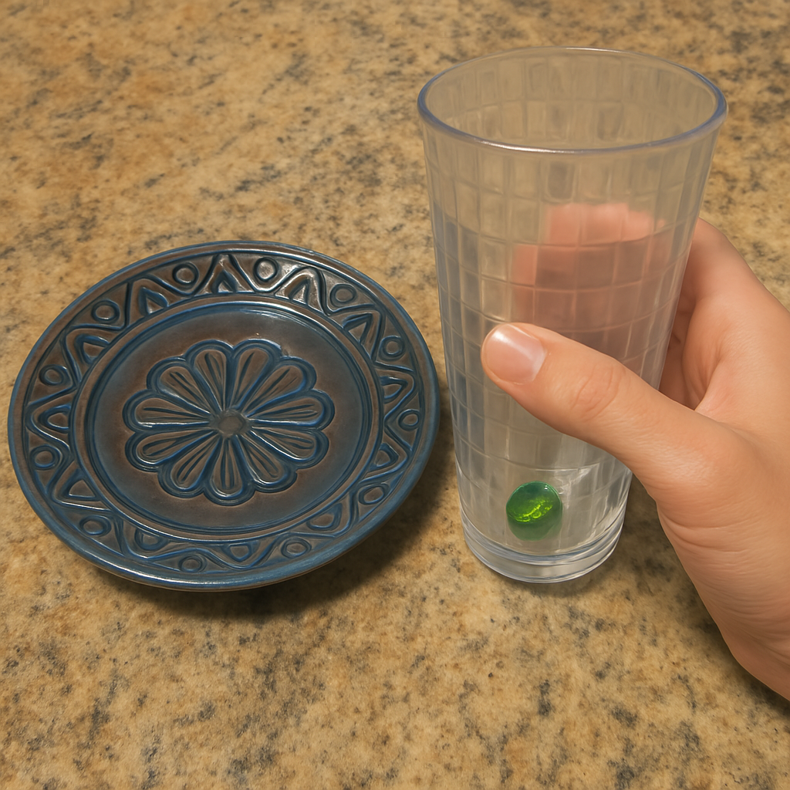

<!-- TODO! ping Matthew Berman about this post -->

I gotta say – _I love it living in exponential times_. I can just wish that something existed and then within a month it does! This time it happened with [OpenAI's 4o image generation release](https://openai.com/index/introducing-4o-image-generation/). In this blog post I'll briefly cover the release and why I think it's pretty cool. Then I'll dive into a new opportunity that I think is even more exciting – _visual reasoning_.

<figure markdown="span">
  { width="600px" align=left}
</figure>

<!-- more -->

!!! note "Rather watch than read?"

    Hey, I get it - sometimes you just want to kick back and watch! Check out this quick video where I walk through everything in this post. Same great content, just easier on the eyes!

    <figure markdown="span">
      <iframe width="70%" src="https://www.youtube.com/embed/-xVKMqR4_f0" title="Visual Reasoning is Coming Soon" frameborder="0" allow="accelerometer; autoplay; clipboard-write; encrypted-media; gyroscope; picture-in-picture" allowfullscreen></iframe>
    </figure>

## Why Image Manipulation with LLMs Stinks
Working with images in Multimodal LLMs has been a mostly one-sided affair. On one hand, it's really cool that you can drop an image into an LLM conversation and get the model to reason about it. But when you ask the model to generate an image, there is a disconnect, because all the model can do is describe the image in text and then call out to an external image generation tool to generate the image based on that text. Text is a poor communication medium for images, and the resulting image is often quite disconnected from the expected result because the short description that the LLM provides to the image generation tool will rarely capture the full context of the conversation.

The problem is most pronounced when attempting to go back and forth working on an idea for an image. You can show the LLM an image of your cat and then say "make this cat wear a detective hat and a monocle". The best the model can do is to put a detective hat and monocle on _some_ cat, not the one in your image. To make matters worse, the model can't even see the image that it has just created. So if you ask for a modification to first generation attempt, then the subsequent generations are really just starting over from scratch and hoping that a more detailed description to the image generation tool will make things better... it won't.

<figure markdown="span">
  { width="300px" align=left}
  { width="300px" align=right}
  <figcaption>Left: OpenAI's pet cat. Right: The best a traditional LLM can do when asked to give it a detective hat and monocle.</figcaption>
</figure>

## OpenAI's Release Brings True Image Manipulation to LLMs
OpenAI's image generation release changes all of this. OpenAI's newest GPT-4o model carries the full context of the conversation into the image generation, and rather than call out to an external model, it is the very same GPT-4o model that does the image generation. By carrying the full context of the conversation – _including the previous images_ – into the generation of the new image you can generate much more consistent imagery.

Thus, stealing OpenAI's example, you can show it a photo of your cat, tell it to give _your cat_ a detective hat, et voila! It works!

<figure markdown="span">
  { width="300px" align=left}
  { width="300px" align=right}
  <figcaption>Left: OpenAI's pet cat. Right: GPT-4o's generation when asked to give the same cat a detective hat and monocle. Much more consistent!</figcaption>
</figure>

Now if all we could do with this technology is stick silly costumes on our cats, then this would honestly be a pretty lame achievement. But think about what we're angling for here. You'll be able to turn hand-drawn garbage into sophisticated infographics and marketing material. You'll be able to take crappy matplotlib charts and reformat them as professional-looking plots that go into slides. You'll be able to try on clothes virtually before you buy them. You'll be able to create photo collages from your photos, game assets, and 3D models. You'll be able to edit your vacation photos to remove that one person who blinked. You'll be able to take a photo of your living room and try out different furniture arrangements and color schemes. You'll be able to take a photo of your garden and get suggestions for where to plant new flowers. The possibilities are endless when you can manipulate images with the full context of a conversation.

## Visual Reasoning will be the Real Innovation 
All of the above is but prologue for what will come next. Models perform better when they take time to reason. This is because models have no internal monologue. Whereas humans pause and think about a question prior to answering, models have to generate tokens in order to think. But to this point models have only been able to reason in the space of words, and words are ill-suited for reasoning through many types of real world problems. But soon the models' new image manipulation capabilities will power a new form of reasoning. Right now, this ability is mostly useful for image editing. Soon, models will have the ability to visualize different scenarios and visually reason about the world around them.

### Demoing Visual Reasoning
Let's try out an example right now and get a glimpse of how visual reasoning will work. For our experiment we'll use [Matthew Berman's marble in a cup problem](https://www.youtube.com/watch?v=aoikSxHXBYw&t=546s) – it's one of his go-to reasoning challenges when playing around with a new model:

> I've put a marble in a glass. The glass is then turned upside down and put on a table. Then the glass is picked up and put into the microwave. Where is the marble?

It's a great problem because it requires common sense knowledge of how objects work in the world, and it's especially suited for this post because it requires spatial reasoning to extrapolate to a new scenario. I asked the new GPT-4o a variant of this problem in text:

> I set a plate on a table, and glass next to it. I set a marble on the plate. Then I pick up the marble, drop it in the glass. Then I turn the glass upside down and set it on the plate. Then, I pick up the glass and put it in the microwave. Where is the marble?

I've added an extra item, a plate, for just a bit more complexity. Here's the answer it gave me:

> The marble is **in the microwave, inside the glass.**
>
> Here's a breakdown of what happened:
>
> You placed a **marble on the plate.**
>
> You **picked up the marble and dropped it in the glass** — now the marble is **in the glass.**
>
> You **turned the glass upside down and set it on the plate** — unless the glass is sealed or the marble is somehow stuck, the marble would **fall out onto the plate.**
>
> Then you **picked up the glass (now empty) and put it in the microwave.**
>
> So at this point:
>
> The **glass is in the microwave.**
>
> The **marble is on the plate, outside** the microwave.
>
> But you asked: Where is the marble? You didn't say you picked it up again, so based on what you said, the marble is **on the plate, not in the microwave.**
>
> Want to run it back or add any twists?

It's actually a pretty weird answer. It immediately answers – _incorrectly_ – then performs post-hoc chain-of-thought reasoning and comes to the correct answer but ignores the fact that it completely contradicted itself.

Let's now do a vision-enhanced version of this chain-of-thought reasoning and demonstrate how spatial reasoning will improve the model's reasoning capabilities.

<figure markdown="span">
  { width="600px" align=left}
  <figcaption>Problem Statement Image</figcaption>
</figure>

I prompted it with the following (including extra requirements to think visually):

> I'm going to pick up the marble, put it in the glass, turn the glass over onto the plate, pick the glass up, and then put the glass in the microwave. 
>
> The question is, where is the marble?
>
> Solve this one step at a time using images to imagine what happens at each step. For each step, first state the step, and then generate an image corresponding to what the scene will look like after that step. And then summarize the image in English, highlighting the important aspects for solving the problem.

Here are the reasoning responses from the model:
<figure markdown="span">
  { width="600px" align=left}
</figure>

> Step 1: Pick up the marble.
>
> In the image, the marble has not yet been moved, but we are about to pick it up and place it in the glass.

<figure markdown="span">
  { width="600px" align=left}
</figure>

> Step 2: Put the marble in the glass.
>
> In the image, the marble is now inside the glass, and the plate is empty.

<figure markdown="span">
  { width="600px" align=left}
</figure>

> Step 3: Turn the glass over onto the plate.
>
> In the image, the glass is now upside down on the plate, trapping the marble inside.

<figure markdown="span">
  { width="600px" align=left}
</figure>

> Step 4: Pick the glass up.
>
> In the image, the hand is lifting the glass off the plate. The marble remains on the plate, as it is no longer contained.

<figure markdown="span">
  { width="600px" align=left}
</figure>

> Step 5: Put the glass in the microwave.
>
> In the image, the glass is now inside the microwave with the marble at the bottom.
>
> Final answer: The marble is inside the microwave, at the bottom of the glass.

So... uh... notably, we made some amazingly consistent images, and then _completely_ got the answer wrong. And we were so close! At Step 4, the model acknowledged that the marble was no longer contained in the glass. Unfortunately, by the time the glass was in the microwave, the model imagined that the marble had somehow followed it.

### Training Models to Think Visually

I think the failure to correctly use visual reasoning is because the model hasn't yet been _trained_ for visual reasoning.

Who knows how OpenAI trained these models, but based on their [debuting post](https://openai.com/index/introducing-4o-image-generation/), the training to date is almost certainly unrelated to visual reasoning. The examples in that post – while extremely impressive – are about better rendering for text, and better instruction following. But all the instructions follow examples related to image manipulation rather than reasoning. Instead, we need to start training models _specifically_ to perform visual reasoning.

For visual reasoning practice, we can do supervised fine-tuning on sequences similar to the marble example above. For instance, to understand more about the physical world, we can show the model sequential pictures of Slinkys going down stairs, or basketball players shooting 3-pointers, or people hammering birdhouses together. We can make the model become more socially aware by letting it see sequences of text and images from social interactions, and having it predict body language and facial expressions for the next scene. We can train for spatial reasoning by having models solve tangrams or having them visualize what a contraption will look like when rotated by 90 degrees. If you think for very long it's easy to can come up with tons of ideas like these – visual reasoning is central to most of our lives.

But where will we get all this training data? For spatial and physical reasoning tasks, we can leverage computer graphics to generate synthetic data. This approach is particularly valuable because simulations provide a controlled environment where we can create scenarios with known outcomes, making it easy to verify the model's predictions. But we'll also need real-world examples. Fortunately, there's an abundance of video content online that we can tap into. While initial datasets might require human annotation, soon models themselves will be able to process videos and their transcripts to extract training examples automatically. Consider all the how-to videos online - creators typically explain what they're going to do before demonstrating it. We can use these to create training pairs: given the current scene and verbal description, have models predict what happens next.

As an aside – I think that videos are going to be our richest source of new training data, and we're just now starting to really tap into it. But who owns the all of the video content on the web? YouTube... Google. I'd say that bodes really well for the future of the Gemini models. Wouldn't you?

### From Chain-of-Thought to Reasoning Models

[As early as 2022](https://arxiv.org/abs/2201.11903) we had recognized that LLMs profited from chain-of-thought reasoning. If a model was making a snap judgment and rushing to an incorrect solution, it was commonplace to add a "let's think step by step", hope for a better output, and often get it. Soon, deeper reasoning approaches were discovered. In particular, [Tree of Thoughts](https://arxiv.org/abs/2305.10601) encouraged the model to think through multiple possible approaches for solving a problem, rank them according to perceived feasibility, and then the application would help direct the model optimally through the paths and toward the problem solution.

With OpenAI's o1 model and several models that followed soon thereafter, the ability to do this sort of tree-of-thoughts reasoning is baked into the model. Prior to providing a final solution, the model may now think through the problem within special "thinking" tags. According to DeepSeek (who has been much more transparent than OpenAI), their R1 model has been trained through a form of reinforcement learning with verifiable problems so that the model can be rewarded for efficiently thinking its way to the _verifiable_ correct solution. Interestingly, and reminiscent of tree-of-thoughts, the models can think themselves into a corner – _recognize that they have messed up_ – backtrack, and get back to a better course toward solving the problem.

Enter visual reasoning. In the coming year, models will undergo supervised fine-tuning to develop scene prediction abilities - given a current scene and a proposed change, they'll learn to visualize the outcome. For example, they'll be able to mentally rotate objects in 3D space or anticipate how people might react in social situations. As training progresses using scenarios with verifiable outcomes, models will develop more sophisticated reasoning capabilities. They'll be able to observe their environment, formulate plans, mentally simulate the consequences of different actions, and learn from comparing their predictions to real-world results. This advancement will be particularly transformative for robotics, where physical interaction with the environment requires robust visual understanding and planning.

Currently, there is one obvious problem with visual reasoning – image creation is a very slow process. However, like everything else in our world right now, this will soon become faster and more feasible. But even if the visual processing remains slow, the very act of training the models to reason about images will improve the text reasoning for visual/spatial problems. What's more, the internal representation of the images seems to be created at several levels of granularity – a small blurry image, and then a refined high-def image. The image you see when playing with ChatGPT is the latter, high-def image. Perhaps visual reasoning can make use of the blurry image – it will be quicker to generate and will help with the reasoning process.

## Conclusion
I'm excited about what's coming! Just like every moment for the past 4 years, we're on the cusp of a radical discovery that will change our world – a radical discovery which is soon realized. I don't think this one is going to let us down. The ever-more capable _visual_ reasoning models will be able to make better sense of our work – not only in terms of understanding the mechanics of physical objects, but also in reading social cues, and really in anything else that we do where vision is of use to us! And then 2026 will be the year of the robots...

<figure markdown="span">
  { width="600px" align=left}
</figure>

--- 

### Hey, and if you liked this post, then maybe we should be friends!

- I just wrote a book about Prompt Engineering for LLM Applications. [Maybe you'd be interested in reading it.](/#about)
- Are you stumped on a problem with your own LLM application? [Let me hear about it.](/#contact-blog)
- I'm going to write lots more posts. [Subscribe and you'll be the first to know](/#contact-blog).
