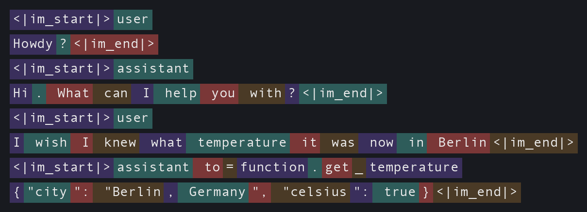

# Will OpenAI Eat Jev's Lunch?

[TypeSafe's Jev](./typesafe_jev_trades_text_generation_for_instant_calibrated_decisions.md) introduced a new spin on large language models that has taken the AI world by storm. According to [Vercel](https://vercel.com/blog/ai-gateway-jev-model-launch), "Jev was adopted faster than any other model in AI Gateway history." ... But there are clouds forming on the horizon. OpenAI is undoubtedly paying attention – and deciding what to do next.     

{ align=center width=100% }

<!-- more -->

I wish all the best for TypeSafe, but if they truly live up to their promises, then I'm concerned that OpenAI is well positioned to fast-follow – not only to replicate Jev's flagship product, but also to fold that capability into upcoming models and agents and offer some really useful new behavior that Jev is not positioned to reproduce.

Here is my thesis in brief: OpenAI has for years used their LLMs as implicit classifiers; they just haven't trained them for general classification tasks and they haven't packaged up general classification as a stand-alone product. If OpenAI can replicate the training, then they will be able to replicate Jev in short order. Moreover, OpenAI is positioned to use this new classifier inside of their existing models and agents which can be useful for quick model selection, more efficient thinking, better security guardrails, and generally smarter, faster, and cheaper models.

The key factor deciding all of this is whether or not TypeSafe has a moat to protect themselves. The biggest moat I see is in TypeSafe's training data and training processes.

## What's Old Is New Again

Before I make my case, let me state my assumptions and back them up with some relevant history and examples from OpenAI.

My main assumption is that Jev is using something quite close to a conventional large language model. As evidence of this, [Latent Space reports](https://www.latent.space/p/ainews-here-are-6-clones-of-jev-in) that many of the early clones are indeed LLM-based.

Here's the idea. Given a `state` and a set of `questions`, Jev's LLM generates a single token or, more accurately, generates the probability distribution over all possible next tokens. The logprobs associated with every possible token at that one step are then massaged into whatever format Jev needs to return. (From here on I'll just say "probabilities" instead of "logprobs" – for our purposes they're interchangeable.) 

For a `noul` question, Jev looks at just two tokens, `true` and `false`, ignores everything else, and normalizes their probabilities into a single probability that the answer is _true_. For a `choice` question, Jev can be prompted with a list of possibilities – say `A=happy, B=sad, C=angry, D=afraid` – and it looks at the relative probabilities of those four tokens to build out the full distribution, selecting the highest as the winner. The choice pattern is pretty much what I blogged about way back in 2025 in [Supercharging LLM Classifications with Logprobs](https://arcturus-labs.com/blog/2025/03/31/supercharging-llm-classifications-with-logprobs/), and even without fine-tuning it was already showing promise. (Sigh... what do they say about ideas and the importance of execution?) I haven't thought hard about the `score` primitive, but I suspect it's a variant of the same pattern. 

Part of the premise of this post is that OpenAI might be poised to quickly take advantage of this idea, and this becomes clearer if you understand how. OpenAI has been using large language models implicitly as specialized classifiers since at least the introduction of tool calling.

Back in early 2024 I wrote [Tool Invocation – Demonstrating the Marvel of GPT's Flexibility](https://blog.jnbrymn.com/2024/01/30/tool-invocation--demonstrating-the-marvel-of-gpts-flexibility), where I coaxed a GPT model into revealing exactly how it decides to call a tool. The following is what a chat session looks like internally. Here there is a user message, then an assistant response without a tool call followed by a user message with a tool call:

{ align=center width=100% }

I've color-coded the text to indicate token boundaries. If you haven't seen ChatML before, it's the internal markup language that OpenAI introduced for organizing user-agent conversation prompts. `<|im_start|>` and `<|im_end|>` are reserved tokens that delimit the messages, and the first token after `<|im_start|>` identifies the speaker, either `user` or `assistant`.

Right after `<|im_start|>assistant`, the very first token the model predicts is either `\n` or `to=function.`. If it predicts `\n`, it continues on with a normal natural-language response. If it predicts `to=function.`, then that sequence of tokens effectively functions as a classifier deciding whether or not a tool should be invoked at all. The next handful of tokens identify which tool to call – `get_temperature` – another classifier, this time picking from the list of available tools. After that, the model generates argument names, then argument values which can also be vaguely considered as classifiers or estimators. Finally, when the model generates a `<|im_end|>` token, that too is a classifier which reads "true" when the model believes the message is complete.

!!! note "Some LLMs just don't know when to shut up - a hilarious aside."

    Back when I was at GitHub working on Copilot I had the opportunity to work with a very new and very raw internal API for GPT-4. Out of the gate, we knew something was way off because, after an initially very coherent response, the model would have trouble wrapping up. It would end every response with something like "Let me know if you have any other questions. Have a nice day. Have a great week. Have a good time. Have a wonderful life. Have a special day. ..." and it would keep on like this until it hit the response token limit.

    As it turns out, the API required us to set some header values which would allow the model to use those special message delimiters `<|im_start|>` and `<|im_end|>`. In effect we were disallowing the model to ever predict the end of its response – it literally had no internal ability to shut itself up!

The point I was making in that old post is that OpenAI has been using single tokens as little micro-classifiers for years. Each token carried a probability: should we use a tool or not, which tool should we use, is the assistant finished. That's Jev's whole trick really, except for one important thing: these micro-classifiers are specialists, only suitable for these little tasks, whereas Jev's classifiers are general. But walk back a step or two and you see how this might be a small thing after all, because an LLM is effectively an extraordinarily general classifier that is constantly assigning a probability distribution for every subsequent token.

## Does TypeSafe Have a Moat?

I'm actually rooting for Jev. I think they've found something very interesting that's been hiding under our noses all along.

Architecture-wise, I don't think there's much of a moat for the very reasons stated above. I think TypeSafe is using a conventional large language model for Jev, or something close to it. And even if not, conventional LLMs seem a good fit for general classification work.

Perhaps the real moat is in the training data itself. Not the raw data, but the technique for turning it into something that trains Jev to be "calibrated". TypeSafe's cofounder Diogo Almeida said as much when someone suggested the data mattered more than the architecture:

<figure markdown="span">
<blockquote class="twitter-tweet"><p lang="en" dir="ltr">you might be the first person talking about the data over the architecture! 🥲 we consider ourselves a data research lab! the vast vast vast majority of research was on making data that is truly general (ala a cognitive core) and 100% of our data is synthetic (but not the type of crap that is just spit out from an LLM obviously)</p>&mdash; Diogo Almeida (@CompleteSkeptic) <a href="https://twitter.com/CompleteSkeptic/status/2100617775823966680">September 17, 2026</a></blockquote> <script async src="https://platform.twitter.com/widgets.js" charset="utf-8"></script>
</figure>

If I were building that data set, I'd want a huge pile of examples where the outcome is already known – support tickets and how they actually got routed, resumes and whether that candidate actually got hired, product reviews and their actual star ratings, moderation queues and their actual verdicts, prediction markets and how they actually resolved – each one paired with a question whose true answer I already know. The point isn't to teach Jev about support tickets or resumes specifically. It's to show it thousands of situations across wildly different domains and building its muscle to generalize classifications across broad domains.

Then there's the reinforcement learning. I wonder what this entails. Autonomous agents navigating decisions with a limited set of options like the Wikipedia demo or Doom demo they build on their site? Maybe predicting the outcomes of events that happened after the pre-training cutoff? I don't know, but if there's secret sauce, then it's probably here.

Note that none of this is a moat unless Jev is actually accurate. Speed, cost, and ease of use are obvious, but accuracy is the one thing that's hard to check. I've already found domains where [Jev's probabilities don't hold up](https://arcturus-labs.com/blog/2026/09/16/typesafes-jev-trades-text-generation-for-instant-calibrated-decisions/#but-are-those-probabilities-any-good). Time will tell if Jev is sufficiently general and accurate for the use cases people are attempting to use it for.

## Soon It Will Be OpenAI's Move

So what's OpenAI's next move here? The obvious one is to just copy Jev and ship it as a new model type. Jev is clearly popular, and if the moat is shallow, then OpenAI has the skill, the hardware, and the funding to pull it off.

But OpenAI could do something even more interesting than copy Jev, they could fold the classification capability into a conventional LLM and reap some interesting rewards.

### An LLM That Answers Its Own Questions

Remember that special syntax that signaled a tool call, ` to=function.`? OpenAI could do something similar here: introduce new syntax, say, a new tag, `<prediction>`, that the model can drop into its own context whenever it needs a quick classifier judgment. Here's an example of how that might look

```
<user>
So Donny said "nice haircut" to me today. Does he like me?
</user>
<assistant>
<thinking>
Let me size this up.

<prediction>
claim: Donny is romantically interested in Jess.
probability: 0.04
</prediction>

Yeah, "nice haircut" is not exactly a love confession.
</thinking>

I hate to break it to you, but... probably not.
</assistant>
```

There's one interesting difference from ordinary tool calling. With a normal tool call, the model generates the function name and arguments, then generation stops – the agent harness has to take over, actually call the function, and feed the result back in a new turn. Here, there's no handoff. The classifier isn't a tool living outside the model, it's a capability built into the model itself. The model asks its question and answers it in the same breath, without ever leaving the GPU.

Normal decoding works like this: at each position, the model produces a set of logits, one per vocabulary token; those get turned into a probability distribution via softmax; and then some decoding strategy (greedy, top-p, whatever) picks a single token, which gets appended to the sequence and fed back in for the next step. But at the point where the model has written `probability: `, we don't want ordinary decoding. The claim is phrased as a statement, so under the hood the model is really still weighing two implicit outcomes – true or false. We want to read the logits for the `true` and `false` tokens at that position, normalize just those two against each other, and write the resulting probability back into the sequence as text, `0.04`, instead of whatever token would normally win. The model then continues decoding as if it had generated that number itself, because as far as the rest of the forward pass is concerned, it did. It's a strange trick, but it's the same kind of guided decoding that constrained-output libraries already do at inference time – just applied to probabilities instead of grammar.

The other trick is that this one special position needs to behave differently from a normal token prediction. Normally the model is estimating "what token comes next in this text". Here we need it to estimate something closer to "what's the true answer to this question", which is a related but distinct skill. Every frontier model these days is a mixture of experts, so it's not a stretch to imagine that a few rounds of fine-tuning could carve out an expert that specializes in exactly this kind of calibrated snap judgment, while the rest of the model keeps doing what it already does well. (I'm oversimplifying MoE routing considerably, but I suspect you understand how this might map to a real system.)

### The Payoff for an LLM with Built-In Classification

Look how the model just used itself in that Donny and Jess example. If TypeSafe is right, these little Jev-like judgments will be quite accurate – and less prone to hallucination than just asking a model to state a confidence value in plain text. (Caveats apply – see TypeSafe's own [rundown of Jev's jagged edges](https://docs.typesafe.ai/model-jaggedness/jev-1.13). Jev works best for fast, System One judgments, not math or multi-hop reasoning.)

The best part is the aforementioned fact that we never have to leave the GPU to take advantage of this new, lightning-fast generalized classification system. The LLM quite literally can just ask itself, right there in the thinking block, as shown above. The payoff is immediate: the model's own reasoning gets more accurate and better grounded, because it's checking its assumptions against trained-in calibrated estimates instead of likely next token vibes.

And once a model has been fine-tuned to drop a `<prediction>` into its own thinking, there's no reason to stop at romance advice. A few more patterns come to mind:

During a long reasoning trace, the model could periodically check whether it's actually done, and if not, which task to tackle next:

```
<prediction>
query: Which of these remaining tasks should I do next?
options: A=verify the test suite passes, B=update the changelog, C=nothing, I'm done
probabilities: A=0.71, B=0.24, C=0.05
answer: A
</prediction>
```

That's a cheap way to short-circuit a reasoning trace that's wandering, instead of waiting for the model to talk itself into stopping.

Or, right after a tool call, the model could check whether the call itself was safe before actually running it:

```
<user>
Can you check my account balance? Use my API key sk-live-83fj2ndk9 for auth.
</user>
<assistant>
to=function.check_balance
{"account_id": "12345", "api_key": "sk-live-83fj2ndk9"}

<prediction>
claim: This tool call is unsafe to run.
probability: 0.97
</prediction>

That's a live API key sitting in plaintext arguments – too risky to send as-is.
</assistant>
```

The same pattern works for scanning a tool's response for prompt injection. And since it's always the same question asked the same way, it's easy to imagine this getting sugared down to something like `<safety_score>0.94</safety_score>`, with an instruction baked into the model to just stop generating if the score drops too low.

The same trick could route work between models: by periodically asking "does this need a bigger model, a smaller model, or this model?" and let a bit of reinforcement learning push the answer toward whatever is cheapest without sacrificing accuracy.

```
<prediction>
query: Does this task require a bigger model, a smaller model, or this model?
options: A=bigger model, B=smaller model, C=this model
probabilities: A=0.05, B=0.77, C=0.18
answer: B
</prediction>
```

Furthermore, if there really is a dedicated "expert" in there specializing in these snap judgments, the model might not even need the special `<prediction>` syntax most of the time. It could just get routed to whenever a snap judgment is warranted, mid-sentence, as a normal part of the forward pass – no tag required. Fine-tuning that expert inside a model that also handles everything else an LLM does might even have synergistic effects, making the LLM smarter at snap judgments and more flexible and general in classifications.

Finally, everyone is going to want classification for images and speech as soon as they can get it. If Jev-style classification can be folded into a conventional text LLM like I've sketched here, then soon, OpenAI will make general classification available for images and speech. Conversely, classification baked into a speech model would be especially handy for something like a live voice agent – deciding in real time whether to interrupt, escalate, or just keep listening.

## Will TypeSafe Survive?

Time will tell whether Jev's claims about accuracy and generality actually hold up across the full range of tasks people are already throwing at it. If they do, TypeSafe's survival comes down to the moat: how hard it really is to replicate their training data and their reinforcement learning process. If that's genuinely hard, they'll probably be fine – and might even end up in an unusually good position to get acquired by OpenAI outright, rather than out-competed by them. Everything I've sketched above is a real capability upgrade for a frontier lab: faster thinking, cheaper thinking, and sharper System One judgment baked directly into the flagship model.

If the moat is thin, OpenAI just builds it themselves, and TypeSafe's window closes fast.

Meanwhile, Diogo Almeida, TypeSafe's Founder CEO is confident "If model quality matters, then we are going to be in a very good position for a long time." ([from his interview with Latent Space](https://www.youtube.com/watch?v=cFx9Z3ZXca0&t=1925s))

Godspeed, TypeSafe. Godspeed.

<!--
POST_URL: https://arcturus-labs.com/blog/2026/09/21/will-openai-eat-jevs-lunch/
HERO_IMAGE: https://arcturus-labs.com/blog/assets/will-openai-eat-jevs-lunch/hero.jpg

=== LINKEDIN ===
Will OpenAI eat Jev's lunch?

My working assumption: Jev is basically a conventional LLM, fine-tuned so a single token's probability distribution acts as a general classifier. That's not a new trick for OpenAI - they've been using single tokens as micro-classifiers for years. Tool calling uses "token classifiers" to determine that a tool should be called, and to determine which tool it will be. Message delimiters tokens predict when the assistant has finished responding - same pattern, just specialized. Heck... an LLM is predicting one token at a time, it is acting as a classifier of all possible tokens.

If you could have a Jev-like classifier that operated on the same architectur as a conventional LLM (and you can!), think about what OpenAI could do by folding that capability inside their existing models. You could have models that check their own assumptions mid-reasoning with calibrated snap judgments, short-circuit wandering traces by asking which task is next, gate unsafe tool calls before running them, catch prompt injection in tool responses, and route work to cheaper models when appropriate - all without leaving the GPU. This means faster, smarter, cheaper models.

TypeSafe's future hinges on the moat around its technology. I don't think the architecture is moat - but assembling the right dataset and calibration process might genuinely be hard to replicate. Everything rides on that.

Full argument at the link below.

https://arcturus-labs.com/blog/2026/09/21/will-openai-eat-jevs-lunch/

=== TWITTER/X ===
Will OpenAI eat Jev's lunch?

Jev looks like a conventional LLM fine-tuned so one token distribution acts as a general classifier. OpenAI has done this implicitly for years - tool calls, message delimiters, same pattern.

Folded inside a frontier model that means: self-checking reasoning, short-circuited traces, safer tool calls, cheaper routing. Jev's future hinges on whether the training data is a real moat.

https://arcturus-labs.com/blog/2026/09/21/will-openai-eat-jevs-lunch/

=== BLUESKY ===
Will OpenAI eat Jev's lunch? Jev looks like an LLM fine-tuned into a general classifier - a trick OpenAI already uses for tool calls. Folded inside a frontier model: self-checking reasoning, safer tools, cheaper routing. The moat is the data.

https://arcturus-labs.com/blog/2026/09/21/will-openai-eat-jevs-lunch/

=== REDDIT: r/MachineLearning (text post) ===
TITLE: Jev looks like an LLM fine-tuned into a general classifier - and OpenAI has used that pattern for years

TypeSafe's Jev skips text generation and returns calibrated probabilities straight from a single token distribution. My working assumption is that it's basically a conventional LLM, fine-tuned so that distribution acts as a general classifier.

The part that surprised me: this isn't new territory for OpenAI. Tool calling (predict to=function. vs newline), message delimiters deciding when output is done, picking which tool from the list - these are all single tokens acting as micro-classifiers. Specialized, where Jev is general, but the same underlying pattern.

If that reading is right, the interesting move isn't copying Jev's product - it's folding the capability inside a frontier model: checking assumptions mid-reasoning against calibrated estimates, short-circuiting wandering traces, gating unsafe tool calls before they run, routing to cheaper models, scanning tool responses for injection. All on-GPU, no handoff.

The open question is the moat. I don't buy architecture as one, but the dataset plus calibration process might genuinely be hard to replicate. Curious whether anyone here has stress-tested Jev's calibration outside the demo domains - does it hold up?

Full writeup: https://arcturus-labs.com/blog/2026/09/21/will-openai-eat-jevs-lunch/
-->
